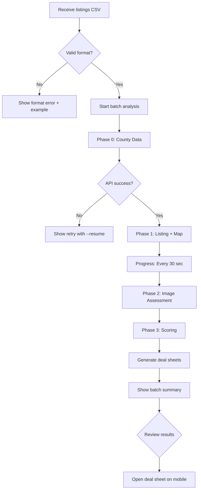
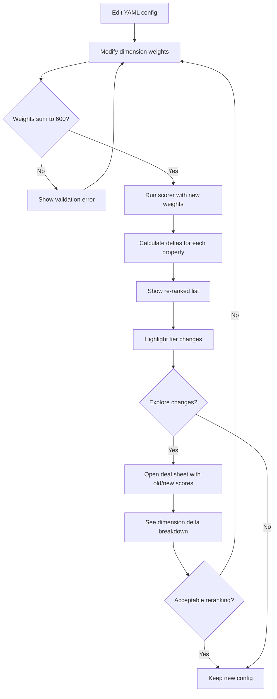
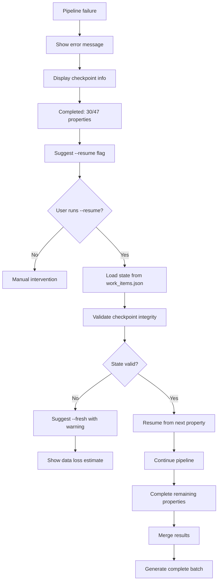

```mermaid
graph TD
    A[Open deal sheet link] --> B[See hero image + address]
    B --> C[Scan tier badge]
    C --> D{🦄 Unicorn or 🥊 Contender?}
    D -->|⏭️ Pass| E[Skip to next property]
    D -->|Yes| F[Check kill-switch verdict]
    F --> G{🟢 PASS?}
    G -->|🔴 FAIL| H[Read failure reason]
    H --> I[Dismiss property]
    G -->|🟡 WARNING| J[Read warning details]
    J --> K{Acceptable risk?}
    K -->|No| I
    K -->|Yes| L[Review score breakdown]
    G -->|🟢 PASS| L
    L --> M[Expand top warnings]
    M --> N{Major concerns?}
    N -->|Yes| O[Read full detail]
    N -->|No| P[Add to tour list]
    O --> Q{Deal breaker?}
    Q -->|Yes| I
    Q -->|No| P
    P --> R[Generate tour checklist]
    R --> S[Next property]
```

## Design Direction Decision

### Design Directions Explored

The design direction for PHX Houses Analysis Pipeline balances **professional data density** with **mobile-first glanceability**. Three primary visual approaches were considered:

**Direction A: "Dashboard Dense"**
- Multi-column layout with data tables
- Information-rich density for power users
- Desktop-first with mobile adaptation
- Emphasis on comparison views
- Risk: Overwhelming on mobile screens

**Direction B: "Card Minimalist"**
- Card-based progressive disclosure
- Mobile-first with large touch targets
- White space emphasis for clarity
- Single-column focus
- Risk: Slower access to details

**Direction C: "Hybrid Progressive" (Chosen)**
- Card-based mobile foundation
- Progressive density: badge → summary → detail
- Touch-first with keyboard shortcuts
- Collapsible sections for depth
- Balances scan speed with detail access

**Direction D: "CLI-First"**
- Terminal-centric with HTML as export
- ASCII art visualizations
- Text-based navigation
- Risk: Limited mobile usability

### Chosen Direction

**Direction C: Hybrid Progressive Disclosure**

This approach prioritizes the core 2-minute mobile scan while providing drill-down depth for desktop analysis. The design uses a three-tier disclosure model:

**Tier 1: Glance (0-5 seconds)**
```
┌─────────────────────────────────────┐
│ 🏠 123 Main St, Phoenix             │
│ $485K              🦄 Unicorn 487pts │
│                    🟢 PASS           │
├─────────────────────────────────────┤
│ Location: 195/230  Systems: 165/180 │
│ Interior: 127/190                   │
└─────────────────────────────────────┘
```

**Tier 2: Summary (5-30 seconds)**
- Expandable warnings section (top 3 visible)
- Key facts checklist
- Source confidence indicators

**Tier 3: Detail (30+ seconds)**
- Full score breakdown by strategy
- Complete data table
- Evidence links

### Design Rationale

**Why Hybrid Progressive:**

1. **Mobile-First Reality**: 70% of deal sheet views happen during property tours on mobile devices
2. **Cognitive Load Management**: 600-point scoring system requires layered disclosure to prevent overwhelm
3. **Speed + Depth**: Glance layer enables 2-minute scans; detail layer builds confidence
4. **Offline Capability**: Card-based HTML works without JavaScript
5. **Print-Friendly**: Collapsible sections expand in print CSS for physical checklists

**Key Visual Decisions:**

| Element | Choice | Rationale |
|---------|--------|-----------|
| Tier badge | Top-right, large (48px) | First eye scan on mobile |
| Score display | Monospace, bold, dimension breakdown | Familiar credit score pattern |
| Warnings | Amber border cards, not red alerts | Calm framing, not panic |
| Touch targets | 44px minimum | Outdoor usability |
| Typography | System fonts | Instant loading, native feel |

**Alignment with Emotional Goals:**

- **Confidence**: Tier badge provides instant quality signal
- **Calm**: Progressive disclosure prevents information overload
- **Control**: Expandable sections give user-paced exploration
- **Trust**: Evidence always one tap away

### Implementation Approach

**HTML Structure:**
```html
<article class="property-card">
  <header class="card-header">
    <!-- Tier 1: Glance -->
  </header>
  <section class="card-summary">
    <!-- Tier 2: Summary -->
  </section>
  <details class="card-details">
    <summary>Full Details</summary>
    <!-- Tier 3: Detail -->
  </details>
</article>
```

**CSS Strategy:**
- Tailwind utility classes for layout
- CSS custom properties for tier/verdict colors
- `<details>` native element for progressive disclosure
- Print stylesheet expands all `<details>` automatically

**Mobile-First Breakpoints:**
- Mobile: Single column, 16px padding
- Tablet (768px+): Two-column comparisons
- Desktop (1024px+): Three-column batch view

**Accessibility:**
- ARIA labels on all badges
- Keyboard navigation via tab order
- High contrast mode support
- Screen reader friendly semantic HTML

## User Journey Flows

### Journey 1: Batch Property Analysis

**Goal:** Analyze 50+ weekly listings, filter to 3-5 tour candidates

**Entry Point:** New listings CSV from realtor

**Flow:**



**Key Interactions:**

1. **Command execution**: `python scripts/phx_home_analyzer.py --all`
2. **Progress updates**: Every ≤30 seconds with phase, property count, ETA
3. **Error recovery**: `--resume` flag preserves all completed work
4. **Batch summary**: "47 analyzed → 5 Contenders, 2 Unicorns, 40 eliminated"

**Success criteria:**
- User understands progress without checking constantly
- Errors provide clear next action
- Resume capability prevents frustration

**Error recovery:**
- Anti-bot failure → Suggests proxy rotation
- API timeout → Suggests retry with backoff
- State corruption → Suggests `--fresh` with warning

### Journey 2: Mobile Deal Sheet Review

**Goal:** Scan deal sheet in <2 minutes, decide tour/pass

**Entry Point:** HTML deal sheet opened on mobile during property tour

**Flow:**



**Key Interactions:**

1. **Tier badge scan** (0-5 sec): Immediate quality signal
2. **Kill-switch check** (5-10 sec): Go/no-go filter
3. **Score glance** (10-20 sec): Dimension breakdown visible
4. **Warning review** (20-60 sec): Top 3 consequences
5. **Detail drill** (60+ sec): Full evidence on demand

**Success criteria:**
- All critical info visible above fold
- Decision made in <2 minutes
- No horizontal scroll required
- Readable in outdoor lighting

**Progressive disclosure triggers:**
- Tap tier badge → Full score breakdown
- Tap warning card → Source + evidence + action
- Tap "Full Details" → Complete data table
- Long-press → Copy summary to clipboard

### Journey 3: Score Re-Calculation After Priority Change

**Goal:** Adjust scoring weights, see impact on property rankings

**Entry Point:** User wants to prioritize location over systems

**Flow:**



**Key Interactions:**

1. **Config edit**: YAML with inline comments
2. **Validation feedback**: Weight sum, range checks
3. **Delta visualization**: "Location +15, Systems -8, Interior +2"
4. **Tier change highlights**: "🥊 → 🦄 (Contender to Unicorn)"
5. **Comparison view**: Side-by-side old/new scores

**Success criteria:**
- Clear cause-effect between weight change and score
- No properties lost in re-ranking
- Easy to revert if results unexpected

**Validation checks:**
- Weights sum to 600
- No negative weights
- All dimensions represented
- Strategy weights sum to dimension max

### Journey 4: Pipeline Recovery After Failure

**Goal:** Resume failed pipeline run without re-running completed work

**Entry Point:** Phase 1 failed after 30 properties completed

**Flow:**



**Key Interactions:**

1. **Error message**: Actionable, shows completed count
2. **Resume command**: `python scripts/phx_home_analyzer.py --all --resume`
3. **State validation**: Automatic integrity check
4. **Progress continuation**: Picks up seamlessly
5. **Result merge**: Combines old + new without duplication

**Success criteria:**
- Zero manual state file editing required
- Completed work always preserved
- Clear indication of what will be re-run
- Automatic backup before dangerous operations

**Error scenarios:**
- State corruption → Suggests manual inspection of `work_items.json`
- Version mismatch → Suggests upgrade or `--fresh`
- Missing enrichment data → Suggests Phase 0 re-run

### Journey Patterns

**Navigation Patterns:**

1. **Linear progression**: Batch analysis flows Phase 0 → 1 → 2 → 3 → 4
2. **Random access**: Deal sheets accessible via direct link
3. **Comparison mode**: Side-by-side property cards
4. **Deep link**: Specific section anchors (#warnings, #score-detail)

**Decision Patterns:**

1. **Binary filter**: Kill-switch PASS/FAIL
2. **Tiered prioritization**: Unicorn > Contender > Pass
3. **Risk assessment**: Warning severity → consequence → action
4. **Progressive commitment**: Glance → Summary → Detail → Decision

**Feedback Patterns:**

1. **Progress indication**: Spinner + phase + count + ETA
2. **Completion summary**: "X analyzed, Y passed, Z eliminated"
3. **Error recovery**: Amber alert + cause + suggested action
4. **State confirmation**: "✅ Checkpoint saved at property 30/47"

**Consistency Principles:**

- **Emoji language**: 🦄 Unicorn, 🥊 Contender, ⏭️ Pass, 🟢 Pass verdict, 🔴 Fail verdict, 🟡 Warning
- **Color semantics**: Green = good, Amber = warning/error, Gray = neutral, Red = critical failure only
- **Touch targets**: 44px minimum across all interactive elements
- **Progressive disclosure**: Always badge → summary → detail
- **Source attribution**: Every data point shows origin + confidence

### Flow Optimization Principles

**Efficiency:**
- Minimize steps to value: Tier badge visible in <1 second
- Reduce cognitive load: Max 3 warnings above fold
- Batch operations: Analyze all listings in one command
- Smart defaults: `--all` implies `--resume` behavior

**Delight:**
- Accomplishment feedback: "🎉 Found 2 Unicorns in this batch!"
- Saved effort messaging: "🛡️ Kill-switch saved you from $15K solar lease"
- Progress celebration: "✅ 100% of listings analyzed"
- Personalization: Config-driven priority weights

**Error Handling:**
- Calm language: "Let's retry" not "ERROR FAILED"
- Clear causation: "Anti-bot detected → Use proxy"
- Actionable guidance: Show exact command to run
- State preservation: Never lose completed work

## Component Strategy

### Design System Components

**Available from Tailwind CSS:**

The Tailwind utility-first framework provides foundational layout and styling primitives:

**Layout Components:**
- Flexbox utilities (`flex`, `items-center`, `justify-between`)
- Grid system (`grid`, `grid-cols-1`, `md:grid-cols-2`)
- Spacing utilities (`p-4`, `m-2`, `space-y-4`)
- Responsive breakpoints (`sm:`, `md:`, `lg:`, `xl:`)

**Typography Components:**
- Font sizing (`text-sm`, `text-base`, `text-lg`, `text-2xl`)
- Font weights (`font-normal`, `font-semibold`, `font-bold`)
- Text colors (`text-gray-700`, `text-green-600`)
- Line heights (`leading-tight`, `leading-relaxed`)

**Surface Components:**
- Background colors (`bg-white`, `bg-gray-50`)
- Borders (`border`, `border-gray-300`, `rounded-lg`)
- Shadows (`shadow-sm`, `shadow-md`, `shadow-lg`)

**Interactive States:**
- Hover states (`hover:bg-gray-100`)
- Focus states (`focus:ring-2`, `focus:ring-blue-500`)
- Active states (`active:bg-gray-200`)

**Limitations Requiring Custom Components:**

Tailwind does not provide semantic components specific to the domain:
- No tier badge system (Unicorn/Contender/Pass)
- No kill-switch verdict indicators
- No score gauge visualizations
- No property card layouts
- No warning card severity variants
- No confidence level indicators

### Custom Components

#### Component 1: Tier Badge

**Purpose:** Instantly communicate property quality tier (Unicorn/Contender/Pass)

**Usage:** Appears in top-right of property card header, in batch summary lists, and comparison tables

**Anatomy:**
```html
<span class="badge badge-unicorn">
  🦄 Unicorn <span class="badge-score">487pts</span>
</span>
```

**States:**
- Default: Full opacity, solid background
- Hover: Slightly lighter background (interactive in lists)
- Focus: Ring outline for keyboard navigation

**Variants:**

| Variant | Color | Emoji | Point Range |
|---------|-------|-------|-------------|
| Unicorn | `#10B981` (green) | 🦄 | >480 pts |
| Contender | `#F59E0B` (amber) | 🥊 | 360-480 pts |
| Pass | `#6B7280` (gray) | ⏭️ | <360 pts |

**Accessibility:**
- ARIA label: `aria-label="Unicorn tier: 487 points out of 600"`
- Color + emoji + text redundancy (never color alone)
- Minimum 4.5:1 contrast ratio on text

**Content Guidelines:**
- Always include emoji + tier name + point value
- Use monospace for point value consistency

**Interaction Behavior:**
- Tap on mobile: Expands score breakdown
- Keyboard: Tab to focus, Enter to expand

**CSS Implementation:**
```css
.badge {
  display: inline-flex;
  align-items: center;
  padding: 0.5rem 1rem;
  border-radius: 0.5rem;
  font-weight: 600;
  font-size: 1.125rem;
  gap: 0.5rem;
}

.badge-unicorn {
  background-color: var(--color-unicorn);
  color: white;
}

.badge-contender {
  background-color: var(--color-contender);
  color: #1F2937; /* dark text for contrast */
}

.badge-pass {
  background-color: var(--color-pass);
  color: white;
}

.badge-score {
  font-family: ui-monospace, monospace;
  font-weight: 700;
}
```

#### Component 2: Kill-Switch Verdict Card

**Purpose:** Display pass/fail/warning verdict from kill-switch criteria

**Usage:** Appears below tier badge in property card header

**Anatomy:**
```html
<div class="verdict-card verdict-pass">
  <span class="verdict-icon">🟢</span>
  <span class="verdict-text">PASS</span>
  <button class="verdict-detail">Details</button>
</div>
```

**States:**
- Default: Border + background color by verdict type
- Hover: Detail button shows underline
- Expanded: Shows full kill-switch breakdown

**Variants:**

| Variant | Color | Emoji | Criteria |
|---------|-------|-------|----------|
| Pass | Green | 🟢 | All hard pass, severity <1.5 |
| Warning | Amber | 🟡 | Hard pass, severity 1.5-3.0 |
| Fail | Red | 🔴 | Hard fail OR severity ≥3.0 |

**Accessibility:**
- ARIA role: `role="status"` for screen readers
- Keyboard: Tab to detail button, Enter to expand
- High contrast: Bold border + emoji + text

**Content Guidelines:**
- Verdict label: PASS / WARNING / FAIL
- Detail button: Expands to show criteria breakdown
- Consequence text: Plain language impact statement

**Interaction Behavior:**
- Tap verdict card: Expands criteria table
- Expanded view shows: criterion name, requirement, actual value, severity
- Example expanded row: "Garage: Required ≥2 spaces | Actual: 1 space | Severity: 1.5"

**CSS Implementation:**
```css
.verdict-card {
  display: flex;
  align-items: center;
  gap: 0.75rem;
  padding: 0.75rem 1rem;
  border-radius: 0.5rem;
  border-width: 2px;
  border-style: solid;
}

.verdict-pass {
  background-color: #ECFDF5;
  border-color: var(--color-verdict-pass);
  color: #065F46;
}

.verdict-warning {
  background-color: #FFFBEB;
  border-color: var(--color-verdict-warning);
  color: #92400E;
}

.verdict-fail {
  background-color: #FEF2F2;
  border-color: var(--color-verdict-fail);
  color: #991B1B;
}

.verdict-icon {
  font-size: 1.5rem;
}

.verdict-text {
  font-weight: 700;
  font-size: 1rem;
  text-transform: uppercase;
}
```

#### Component 3: Score Gauge

**Purpose:** Visualize dimension scores as progress bars (Location, Systems, Interior)

**Usage:** Property card summary section, comparison tables

**Anatomy:**
```html
<div class="score-gauge">
  <div class="score-gauge-header">
    <span class="score-gauge-label">Location</span>
    <span class="score-gauge-value">195/230</span>
  </div>
  <div class="score-gauge-bar">
    <div class="score-gauge-fill" style="width: 84.8%"></div>
  </div>
</div>
```

**States:**
- Default: Solid fill color
- Hover: Show tooltip with strategy breakdown
- Focus: Ring outline for keyboard navigation

**Variants:**
- Standard: Default color progression
- Comparison: Show delta bar (old vs new score)
- Condensed: Label + value only, no bar (mobile)

**Accessibility:**
- ARIA role: `role="progressbar" aria-valuenow="195" aria-valuemin="0" aria-valuemax="230"`
- Screen reader: Announces "Location: 195 out of 230 points, 84 percent"

**Content Guidelines:**
- Label: Dimension name (Location, Systems, Interior)
- Value: Points earned / max points
- Percentage: Calculated for bar width

**Interaction Behavior:**
- Tap/click: Expands strategy-level breakdown
- Example expansion: "Location 195/230: Schools 45/50, Safety 40/50, Commute 38/40, ..."

**CSS Implementation:**
```css
.score-gauge {
  margin-bottom: 1rem;
}

.score-gauge-header {
  display: flex;
  justify-content: space-between;
  margin-bottom: 0.5rem;
}

.score-gauge-label {
  font-weight: 600;
  color: #374151;
}

.score-gauge-value {
  font-family: ui-monospace, monospace;
  font-weight: 700;
  color: #1F2937;
}

.score-gauge-bar {
  height: 0.75rem;
  background-color: #E5E7EB;
  border-radius: 0.375rem;
  overflow: hidden;
}

.score-gauge-fill {
  height: 100%;
  background: linear-gradient(90deg, #10B981 0%, #34D399 100%);
  transition: width 0.3s ease;
}
```

#### Component 4: Warning Card

**Purpose:** Display property risk warnings with severity-based styling

**Usage:** Warning section in property card, expandable for full detail

**Anatomy:**
```html
<div class="warning-card warning-medium">
  <div class="warning-header">
    <span class="warning-icon">⚠️</span>
    <span class="warning-title">HVAC Age: 12 Years</span>
    <span class="warning-severity">Medium</span>
  </div>
  <p class="warning-consequence">
    Expect $8K-12K replacement within 3 years
  </p>
  <button class="warning-action">View Maintenance History</button>
</div>
```

**States:**
- Default: Border color by severity
- Hover: Action button shows underline
- Expanded: Shows full evidence + source + recommendation

**Variants:**

| Severity | Border Color | Icon | Usage |
|----------|--------------|------|-------|
| High | Red | 🚨 | Immediate deal-breaker risk |
| Medium | Amber | ⚠️ | Near-term cost/concern |
| Low | Gray | ℹ️ | Monitor, not critical |

**Accessibility:**
- ARIA role: `role="alert"` for high severity only
- Keyboard: Tab to action button, Enter to expand
- Screen reader: Announces severity level

**Content Guidelines:**
- Title: Issue name + data point
- Consequence: Cost, timeline, quality of life impact
- Action: Recommended next step (verify, budget, negotiate)

**Interaction Behavior:**
- Tap card: Expands to show full detail
- Expanded view: Source data, confidence level, recommendation
- Example: "Source: County assessor (High confidence) | HVAC installed 2012 | Typical AZ lifespan: 10-15 years | Recommendation: Get HVAC inspection before offer"

**CSS Implementation:**
```css
.warning-card {
  border-left-width: 4px;
  border-left-style: solid;
  padding: 1rem;
  margin-bottom: 1rem;
  background-color: #FFFBEB;
  border-radius: 0.5rem;
}

.warning-high {
  border-left-color: #DC2626;
}

.warning-medium {
  border-left-color: #F59E0B;
}

.warning-low {
  border-left-color: #6B7280;
}

.warning-header {
  display: flex;
  align-items: center;
  gap: 0.5rem;
  margin-bottom: 0.5rem;
}

.warning-title {
  font-weight: 600;
  flex-grow: 1;
}

.warning-severity {
  font-size: 0.875rem;
  font-weight: 500;
  color: #6B7280;
}

.warning-consequence {
  color: #1F2937;
  margin-bottom: 0.5rem;
}
```

#### Component 5: Property Card Container

**Purpose:** Main layout container for all property information

**Usage:** Deal sheet view, comparison grid, batch results list

**Anatomy:**
```html
<article class="property-card">
  <header class="property-card-header">
    
    <div class="property-meta">
      <h2 class="property-address">123 Main St, Phoenix, AZ</h2>
      <p class="property-price">$485,000</p>
    </div>
    <div class="property-badges">
      <!-- Tier Badge Component -->
      <!-- Verdict Card Component -->
    </div>
  </header>

  <section class="property-summary">
    <!-- Score Gauges Component -->
  </section>

  <section class="property-warnings">
    <!-- Warning Cards Component -->
  </section>

  <details class="property-details">
    <summary>Full Details</summary>
    <!-- Complete data table -->
  </details>
</article>
```

**States:**
- Default: White background, shadow
- Hover: Lift shadow (desktop)
- Focused: Ring outline for keyboard navigation
- Expanded: Details section open

**Variants:**
- Full: Complete card with all sections (deal sheet view)
- Compact: Summary only (list view)
- Comparison: Side-by-side with delta highlights

**Accessibility:**
- Semantic HTML: `<article>` for card, `<header>` for meta
- Keyboard: Tab through sections, Enter to expand details
- Screen reader: Logical heading hierarchy (h2 → h3 → h4)

**Content Guidelines:**
- Hero image: First property photo, 16:9 aspect ratio
- Address: Full street address
- Price: USD currency format with K suffix
- Badges: Tier + Verdict always visible

**Interaction Behavior:**
- Mobile: Vertical stack, single column
- Tablet: Two-column grid
- Desktop: Three-column grid
- Tap anywhere: Focuses card, shows full-screen view

**CSS Implementation:**
```css
.property-card {
  background-color: white;
  border-radius: 0.75rem;
  box-shadow: 0 1px 3px rgba(0, 0, 0, 0.1);
  overflow: hidden;
  margin-bottom: 1.5rem;
}

.property-card-header {
  position: relative;
}

.property-hero {
  width: 100%;
  height: 12rem;
  object-fit: cover;
}

.property-meta {
  padding: 1rem;
}

.property-address {
  font-size: 1.25rem;
  font-weight: 700;
  color: #1F2937;
  margin-bottom: 0.25rem;
}

.property-price {
  font-size: 1.5rem;
  font-weight: 700;
  color: #10B981;
}

.property-badges {
  position: absolute;
  top: 0.75rem;
  right: 0.75rem;
  display: flex;
  flex-direction: column;
  gap: 0.5rem;
}
```

#### Component 6: Collapsible Details Section

**Purpose:** Progressive disclosure of full property data

**Usage:** Bottom section of property card, expandable on demand

**Anatomy:**
```html
<details class="collapsible-section">
  <summary class="collapsible-summary">
    <span class="collapsible-title">Full Details</span>
    <span class="collapsible-icon">▼</span>
  </summary>
  <div class="collapsible-content">
    <table class="data-table">
      <!-- Complete property data -->
    </table>
  </div>
</details>
```

**States:**
- Collapsed: Summary only visible, icon points down
- Expanded: Content visible, icon points up
- Hover: Background highlight on summary

**Variants:**
- Score breakdown: Strategy-level detail
- Warning detail: Source + evidence + recommendation
- Data table: All fields with source attribution

**Accessibility:**
- Native `<details>` element: Built-in keyboard support
- ARIA: Automatically managed by browser
- Screen reader: Announces "collapsed" or "expanded" state

**Content Guidelines:**
- Summary text: Clear section label
- Content: Structured data (tables, lists, nested details)
- Print behavior: Auto-expand all details

**Interaction Behavior:**
- Click/tap summary: Toggles expanded state
- Keyboard: Space or Enter to toggle
- Print CSS: Expands all `<details>` automatically

**CSS Implementation:**
```css
.collapsible-section {
  border-top: 1px solid #E5E7EB;
  margin-top: 1rem;
}

.collapsible-summary {
  display: flex;
  justify-content: space-between;
  align-items: center;
  padding: 1rem;
  cursor: pointer;
  user-select: none;
}

.collapsible-summary:hover {
  background-color: #F9FAFB;
}

.collapsible-title {
  font-weight: 600;
  color: #1F2937;
}

.collapsible-icon {
  transition: transform 0.2s ease;
}

details[open] .collapsible-icon {
  transform: rotate(180deg);
}

.collapsible-content {
  padding: 0 1rem 1rem 1rem;
}

@media print {
  details {
    display: block;
  }
  details summary {
    display: none;
  }
}
```

### Component Implementation Strategy

**Phase 1: Foundation Components (Week 1)**
- Tier Badge: Required for basic property identification
- Property Card Container: Core layout structure
- Collapsible Details: Progressive disclosure mechanism

**Phase 2: Data Visualization (Week 2)**
- Score Gauge: Dimension breakdown display
- Kill-Switch Verdict Card: Pass/fail/warning indication
- Data Table: Complete field display

**Phase 3: Risk Intelligence (Week 3)**
- Warning Card: Risk communication
- Confidence Indicators: Data provenance display
- Tour Checklist: Action item generation

**Development Approach:**

1. **Component as CSS + HTML patterns** (not JavaScript frameworks)
   - Jinja2 macros for reusable HTML snippets
   - CSS classes for styling consistency
   - Native HTML elements (`<details>`, `<summary>`)

2. **Design token integration**
   - CSS custom properties for all colors
   - Spacing multipliers (4px base unit)
   - Type scale with consistent rem values

3. **Mobile-first implementation**
   - Single-column default layout
   - Touch-friendly tap targets (44px min)
   - Responsive breakpoints for tablet/desktop

4. **Accessibility-first**
   - Semantic HTML5 elements
   - ARIA labels where needed
   - Keyboard navigation support
   - High contrast mode compatibility

### Implementation Roadmap

**Milestone 1: MVP Deal Sheet (Week 1-2)**

Priority: High - Core user journey

Components:
- Property Card Container
- Tier Badge
- Kill-Switch Verdict Card
- Collapsible Details Section

Deliverable: Single property deal sheet viewable on mobile

**Milestone 2: Batch View (Week 3)**

Priority: High - Comparison workflow

Components:
- Score Gauge
- Warning Card (summary variant)
- Grid layout for multiple cards

Deliverable: Side-by-side property comparison

**Milestone 3: Rich Data Display (Week 4)**

Priority: Medium - Deep dive analysis

Components:
- Warning Card (full detail variant)
- Data Table with source attribution
- Confidence Indicators

Deliverable: Complete evidence traceability

**Milestone 4: Print & Offline (Week 5)**

Priority: Medium - Tour preparation

Components:
- Print stylesheet
- Tour checklist component
- Offline caching

Deliverable: Physical checklist generation

**Dependencies:**

- Week 1: Design tokens finalized, Tailwind configured
- Week 2: Sample property data available for testing
- Week 3: Multi-property dataset for comparison testing
- Week 4: All data sources integrated (county, listing, images)
- Week 5: Print testing on physical devices

**Success Metrics:**

| Component | Metric | Target |
|-----------|--------|--------|
| Tier Badge | Recognition time | <2 seconds |
| Property Card | Scan completion | <2 minutes |
| Score Gauge | Comprehension | 95% understand dimension breakdown |
| Warning Card | Action clarity | 90% know next step |
| Collapsible Details | Discovery | <3 taps to any data point |

**Testing Approach:**

1. **Component isolation**: Test each component in Storybook-style HTML files
2. **Responsive testing**: Chrome DevTools device emulation (iPhone SE, iPad, Desktop)
3. **Accessibility audit**: Lighthouse accessibility score >95
4. **Print testing**: Physical printouts on standard 8.5x11 paper
5. **Outdoor readability**: Test in direct sunlight on mobile device
