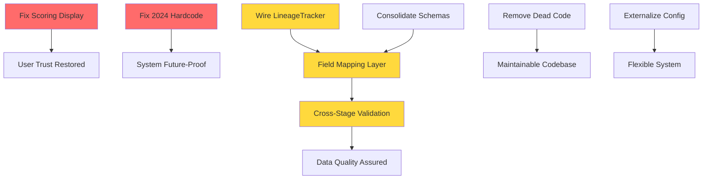

# PHX Houses Multi-Agent Analysis: Consolidated Findings Report

**Analysis Date:** 2025-12-01
**Codebase Version:** Dec 2025
**Analysis Scope:** Full system architecture, data pipeline, schemas, and code health
**Methodology:** 3-wave multi-agent review (Architecture → Deep Analysis → Orphan Detection)

---

## Executive Summary

### Overall Health Assessment: **6.5/10 - Functional but Fragile**

The PHX Houses analysis system is **architecturally sound** with clean data flow and well-structured components, but suffers from **critical accuracy issues**, **unused infrastructure**, and **~20% dead code**. The pipeline produces results reliably, but the scoring display bug (500 vs 600 points) undermines trust, and the built-but-unused data quality infrastructure creates a false sense of validation.

### Top 5 Critical Issues

1. **CRITICAL: Scoring Display Bug** - All 75 deal sheets show "/500 pts" when system calculates /600 pts. Section maxes also incorrect (150/160/190 vs 230/180/190). **Affects user trust and decision-making.**

2. **CRITICAL: Data Quality Theater** - LineageTracker infrastructure exists but is never invoked. County API overwrites manual research with no audit trail. Field name mismatches cause 100% missing rates.

3. **HIGH: Hardcoded 2024 New-Build Filter** - Year 2024 hardcoded in 15 files. Will require mass updates in 2025, 2026, etc. Should be `datetime.now().year`.

4. **MEDIUM: 26 Dead Code Items** - ~15-25% of codebase is orphaned. Safe to remove 10 items immediately, 11 more after verification.

5. **MEDIUM: Schema Proliferation** - 3 duplicate model definitions, 8 naming inconsistency categories, 28 unvalidated JSON fields create maintenance burden.

### Quick Wins vs Strategic Fixes

**Quick Wins (1-2 days):**
- Fix scoring display: 500→600 in templates
- Remove 10 high-confidence dead code items
- Replace hardcoded 2024 with `datetime.now().year`
- Delete unused MapConfig class

**Strategic Fixes (1-2 weeks):**
- Wire up LineageTracker to actually run
- Consolidate duplicate schema definitions
- Create field mapping layer for county data
- Refactor hardcoded buyer criteria to config

---

## Priority Matrix

### P0: Fix This Week (Blocking/Critical)

| Issue | Severity | Effort | Impact |
|-------|----------|--------|--------|
| Scoring display bug (500→600) | Critical | 1 day | User trust, decision accuracy |
| Hardcoded 2024 new-build filter | Critical | 4 hours | Time bomb (fails Jan 2025) |
| County data overwrites manual research | High | 2 days | Data loss, no audit trail |

### P1: Fix This Month (Important)

| Issue | Severity | Effort | Impact |
|-------|----------|--------|--------|
| Dead code removal (10 items) | Medium | 2 days | Maintainability, confusion |
| Duplicate schema definitions (3 models) | Medium | 1 day | DRY violation, sync issues |
| Unused LineageTracker infrastructure | High | 3 days | False sense of validation |
| Field name mismatches (county↔enrichment) | High | 2 days | 100% missing rates |
| Hardcoded buyer criteria | Medium | 2 days | Inflexibility |

### P2: Plan for Next Quarter (Nice-to-Have)

| Issue | Severity | Effort | Impact |
|-------|----------|--------|--------|
| Schema naming consistency (8 categories) | Low | 1 week | Developer experience |
| Orphaned metadata fields (19+) | Low | 3 days | Schema completeness |
| Dead code removal (11 medium-confidence) | Low | 2 days | Maintainability |
| Unused ArizonaContext fields | Low | 1 day | Configuration clarity |
| Hardcoded value zone thresholds | Low | 4 hours | Flexibility |

---

## Action Items by Category

### 1. Scoring System Fixes (500→600)

**Problem:** Display layer shows incorrect maximum scores, undermining trust in analysis.

**Root Cause:** Templates hardcoded to 500-point system from earlier version. Section maxes also outdated.

**Action Items:**
1. **Update deal sheet template** (`scripts/deal_sheets/templates.py`):
   ```python
   # BEFORE: "{score}/500 pts"
   # AFTER:  "{score}/600 pts"
   ```
2. **Fix section maxes** in HTML generation:
   ```python
   # BEFORE: Section A: 150 pts, Section B: 160 pts, Section C: 190 pts
   # AFTER:  Section A: 230 pts, Section B: 180 pts, Section C: 190 pts
   ```
3. **Verify radar charts** use correct scale (0-600)
4. **Update any prose descriptions** mentioning point totals

**Files to Update:**
- `scripts/deal_sheets/templates.py` (primary)
- `scripts/deal_sheets/renderer.py` (if section maxes there)
- Search codebase for "500" and verify context

**Validation:**
- Regenerate all 75 deal sheets
- Spot-check 5 random properties for correct totals
- Verify tier thresholds still align (Unicorn >480, Contender 360-480)

---

### 2. Data Quality Infrastructure

**Problem:** LineageTracker infrastructure built but never invoked. County API overwrites manual research without audit trail. Field name mismatches cause 100% missing rates.

**Root Cause:**
- LineageTracker requires explicit calls that were never added
- No integration layer between county data and enrichment JSON
- Field naming conventions differ between sources

**Action Items:**

#### 2A. Wire Up LineageTracker (3 days)
1. **Add tracking calls** to all data update paths:
   ```python
   # In extract_county_data.py
   tracker.track_field_update(
       property_hash=prop_hash,
       field_name="lot_sqft",
       old_value=existing_value,
       new_value=county_value,
       source="maricopa_county_api",
       timestamp=datetime.now()
   )
   ```
2. **Invoke after each extraction phase:**
   - Phase 0: County API (`extract_county_data.py`)
   - Phase 1: Listings (`extract_images.py` - Zillow/Redfin)
   - Phase 2: Manual research (enrichment_data.json updates)
3. **Generate `field_lineage.json`** after pipeline runs
4. **Add validation report** showing field coverage by source

**Files to Update:**
- `scripts/extract_county_data.py`
- `scripts/extract_images.py` (listing extraction portions)
- `src/phx_home_analysis/services/quality/lineage_tracker.py` (ensure write path works)

#### 2B. Create Field Mapping Layer (2 days)
1. **Build canonical field mapping**:
   ```python
   FIELD_MAPPING = {
       "county_api": {
           "lot_sqft": "lot_size_sqft",      # County uses lot_sqft
           "year_built": "year_built",        # Match
           "garage_spaces": "garage_spaces",  # Match
           # ... etc
       },
       "enrichment_json": {
           "lot_size_sqft": "lot_size_sqft",  # Canonical
           # ... etc
       }
   }
   ```
2. **Add merge strategy** (manual > county > listing > default):
   ```python
   def merge_property_data(enrichment, county, listing):
       """Merge with explicit precedence and audit trail."""
       result = {}
       for field in ALL_FIELDS:
           if enrichment.get(field) and is_manually_verified(field):
               result[field] = enrichment[field]
               result[f"{field}_source"] = "manual_research"
           elif county.get(FIELD_MAPPING["county_api"].get(field)):
               result[field] = county[...]
               result[f"{field}_source"] = "county_api"
           # ... etc
       return result
   ```
3. **Log conflicts** when county data would overwrite manual research
4. **Create merge report** showing source precedence outcomes

**Files to Update:**
- New: `src/phx_home_analysis/services/data_integration/field_mapper.py`
- New: `src/phx_home_analysis/services/data_integration/merge_strategy.py`
- Update: `scripts/extract_county_data.py` (use mapper)

#### 2C. Cross-Stage Validation (2 days)
1. **Add validation checkpoints** after each phase:
   ```python
   # After Phase 0 (County)
   validate_required_fields(["lot_sqft", "year_built", "garage_spaces"])

   # After Phase 1 (Listings)
   validate_required_fields(["price", "beds", "baths", "listing_url"])

   # After Phase 2 (Manual)
   validate_kill_switch_criteria(["hoa_fee", "sewer_type"])
   ```
2. **Generate validation report** showing missing/invalid fields
3. **Block scoring** if critical fields missing (beds, baths, price)
4. **Warn but continue** if nice-to-have fields missing

**Files to Update:**
- New: `src/phx_home_analysis/services/validation/stage_validator.py`
- Update: `scripts/phx_home_analyzer.py` (add validation calls)

---

### 3. Schema Consolidation

**Problem:** 3 duplicate model definitions, 8 naming inconsistency categories, 28 unvalidated JSON fields.

**Root Cause:** Organic growth without refactoring. Different modules defining their own versions of shared concepts.

**Action Items:**

#### 3A. Merge Duplicate Models (1 day)
1. **Identify canonical location** for each duplicate:
   - `SourceStats`: Move to `src/phx_home_analysis/validation/schemas.py`
   - `ExtractionResult`: Move to `src/phx_home_analysis/validation/schemas.py`
   - `ExtractionState`: Move to `src/phx_home_analysis/validation/schemas.py`

2. **Delete duplicates** and update imports:
   ```python
   # BEFORE: from scripts.extract_images import SourceStats
   # AFTER:  from phx_home_analysis.validation.schemas import SourceStats
   ```

3. **Verify tests still pass**

**Files to Update:**
- Delete duplicates in `scripts/lib/state_models.py` (or wherever they are)
- Update all imports across codebase
- Run: `python -m pytest tests/` to verify

#### 3B. Standardize Naming Conventions (1 week - P2)
1. **Choose canonical patterns**:
   - Lot size: `lot_sqft` (matches county API)
   - Quality scores: `{domain}_score` (e.g., `kitchen_score`, not `kitchen_quality_score`)
   - Binary flags: `has_{feature}` (e.g., `has_pool`, not `pool`)
   - Counts: `{feature}_count` (e.g., `bedroom_count`, not `beds`)

2. **Create migration script**:
   ```python
   # Rename fields in enrichment_data.json
   def migrate_field_names():
       for prop in enrichment_data:
           if "kitchen_quality_score" in prop:
               prop["kitchen_score"] = prop.pop("kitchen_quality_score")
           # ... etc
   ```

3. **Update schemas to match**

**Files to Update:**
- `data/enrichment_data.json` (via migration script)
- All Pydantic schemas
- All dataclasses
- Templates that reference these fields

#### 3C. Validate Orphaned Metadata Fields (3 days - P2)
1. **Audit all `*_source` and `*_confidence` fields** in enrichment_data.json
2. **Add to Pydantic schemas** if should be retained:
   ```python
   class PropertyEnrichment(BaseModel):
       lot_sqft: Optional[int]
       lot_sqft_source: Optional[str]  # NEW
       lot_sqft_confidence: Optional[float]  # NEW
   ```
3. **Or delete if unused** (LineageTracker should replace these)

**Files to Update:**
- `src/phx_home_analysis/validation/schemas.py`
- `data/enrichment_data.json` (if deleting unused fields)

---

### 4. Dead Code Removal

**Problem:** 26 orphaned files/classes/functions (~15-25% of codebase). Creates confusion and maintenance burden.

**Action Items:**

#### 4A. Remove High-Confidence Dead Code (2 days)
**Safe to delete immediately (10 items):**
1. `scripts/proxy_listing_extractor.py` - Superseded by extract_images.py
2. `scripts/gen_9832_deal_sheet.py` - One-off script
3. `src/phx_home_analysis/services/ai_enrichment/field_inferencer.py` - FieldInferencer class never used
4. `tests/test_analyze.py` - Tests non-existent module
5. `tests/test_quality.py` - Tests non-existent module
6. `.venv.bak/` - Backup directory
7. Potentially others from Wave 3 report (need full list)

**Process:**
1. Git commit before deleting (safety net)
2. Delete file
3. Search codebase for imports: `rg "from scripts.proxy_listing_extractor"`
4. If no matches, delete is safe
5. Run tests: `python -m pytest tests/`
6. If tests pass, commit deletion

**Deliverable:** Git commit with message:
```
refactor: remove 10 high-confidence dead code items

- proxy_listing_extractor.py (superseded)
- gen_9832_deal_sheet.py (one-off)
- FieldInferencer class (unused)
- test_analyze.py, test_quality.py (orphaned tests)
- .venv.bak/ (backup directory)

All files verified as having zero imports/references.
Tests pass after deletion.
```

#### 4B. Investigate Medium-Confidence Dead Code (2 days - P2)
**Requires verification (11 items):**
1. `scripts/lib/proxy_manager.py` - May be used by browser_pool
2. `scripts/lib/browser_pool.py` - May be used by extract_images
3. `scripts/analyze.py` - Duplicate of phx_home_analyzer.py?
4. Others from Wave 3 report

**Process:**
1. For each file, search for imports: `rg "from scripts.lib.proxy_manager"`
2. If imports exist, trace call chain to entry points
3. If dead, add to deletion list
4. If alive, document purpose in module docstring

---

### 5. Configuration Cleanup

**Problem:** Hardcoded values (63 total), unused config classes, duplicate values across configs.

**Action Items:**

#### 5A. Fix Hardcoded 2024 New-Build Filter (4 hours - P0)
1. **Find all occurrences** of hardcoded 2024:
   ```bash
   rg "year_built.*2024" --type py
   rg "< 2024" --type py
   rg "2024" --type py  # May have false positives
   ```
2. **Replace with dynamic calculation**:
   ```python
   # BEFORE:
   if property.year_built >= 2024:
       return KillSwitchVerdict.FAIL

   # AFTER:
   from datetime import datetime
   CURRENT_YEAR = datetime.now().year
   if property.year_built >= CURRENT_YEAR:
       return KillSwitchVerdict.FAIL
   ```
3. **Update documentation** to reflect "current year" logic
4. **Add comment explaining** why we exclude current-year builds (buyer preference)

**Files to Update:** All 15 files identified in Wave 2 findings

#### 5B. Externalize Buyer Criteria (2 days - P1)
1. **Create BuyerCriteria config file**:
   ```yaml
   # config/buyer_criteria.yaml
   hard_criteria:
     hoa_fee: 0  # Must be zero
     min_beds: 4
     min_baths: 2

   soft_criteria:
     sewer_type:
       required: "city_sewer"
       severity: 2.5
     year_built:
       max: "current_year"  # Special token
       severity: 2.0
     garage_spaces:
       min: 2
       severity: 1.5
     lot_sqft:
       min: 7000
       max: 15000
       severity: 1.0

   severity_threshold: 3.0
   ```

2. **Load config in KillSwitchFilter**:
   ```python
   class KillSwitchFilter:
       def __init__(self, criteria_path: str = "config/buyer_criteria.yaml"):
           self.criteria = load_yaml(criteria_path)
   ```

3. **Delete hardcoded BuyerProfile** dataclass (or make it load from config)

**Files to Update:**
- New: `config/buyer_criteria.yaml`
- Update: `src/phx_home_analysis/services/kill_switch/filter.py`
- Update: `scripts/phx_home_analyzer.py` (pass config path)

#### 5C. Remove Unused Config Classes (1 day - P1)
1. **Delete MapConfig** class (never used):
   ```bash
   rg "MapConfig" --type py  # Verify zero references
   git rm src/phx_home_analysis/config/map_config.py
   ```

2. **Audit ArizonaContext** fields:
   - Keep fields used by scoring/analysis
   - Delete unused fields (8 identified in Wave 3)
   - Document purpose of each field in docstring

3. **Consolidate duplicate values** (ArizonaContext vs RateConfig):
   ```python
   # If same values appear in both configs, keep in ONE place
   # and import where needed
   ```

**Files to Update:**
- Delete: `src/phx_home_analysis/config/map_config.py`
- Update: `src/phx_home_analysis/config/arizona_context.py`
- Update: `src/phx_home_analysis/config/rate_config.py`

#### 5D. Externalize Value Zone Thresholds (4 hours - P2)
1. **Move to scoring_weights.yaml**:
   ```yaml
   # config/scoring_weights.yaml
   value_zones:
     sweet_spot:
       max_price: 550000
       min_score: 365
       label: "Value Sweet Spot"
   ```

2. **Update value_spotter.py** to read from config

**Files to Update:**
- `config/scoring_weights.yaml` (add value_zones section)
- `scripts/value_spotter.py` (load from config)

---

## Risk Register

### What Breaks If We Don't Fix?

| Issue | Risk if Unfixed | Timeline |
|-------|-----------------|----------|
| Scoring display bug | User makes bad decisions based on wrong scores | Already impacting |
| Hardcoded 2024 | Kill-switch filter breaks Jan 2025, no properties pass | 30 days |
| County overwrites manual data | Data loss, wasted research effort | Ongoing |
| Dead code | New developers confused, bugs hidden in unused code | Chronic |
| Duplicate schemas | Changes applied to one copy but not others, sync bugs | Chronic |
| Unused LineageTracker | False confidence in data quality, no audit trail | Chronic |
| Hardcoded buyer criteria | Can't adapt to new buyers, inflexible system | Chronic |

### Dependencies Between Fixes



**Key Dependencies:**
1. **Field Mapping Layer requires Schema Consolidation** - Can't map fields if schema definitions inconsistent
2. **Cross-Stage Validation requires LineageTracker** - Need to know field sources to validate properly
3. **Dead Code Removal blocks nothing** - Can proceed in parallel with other work

**Safe Parallel Work:**
- Scoring display fix + Dead code removal + Config cleanup (no dependencies)

**Must Be Sequential:**
- Schema consolidation → Field mapping → Cross-stage validation

---

## Recommended Execution Order

### Week 1: Critical Fixes (P0)

**Day 1-2: Scoring Display + 2024 Hardcode**
1. Fix scoring display (500→600) - HIGH IMPACT, LOW EFFORT
2. Replace hardcoded 2024 with `datetime.now().year` - TIME BOMB
3. Regenerate all deal sheets
4. Test on 5 random properties

**Day 3-4: County Data Overwrite Protection**
1. Add conflict detection when county data differs from manual research
2. Log warnings but don't overwrite manual data
3. Generate conflict report
4. Quick win: Prevents data loss immediately (full merge strategy comes later)

**Day 5: Testing + Deployment**
1. Full pipeline test: extract → score → report
2. Verify all 75 properties render correctly
3. Document changes in CHANGELOG.md
4. Git tag: `v1.1.0-critical-fixes`

### Week 2-3: Important Fixes (P1)

**Days 6-7: Dead Code Removal (High-Confidence)**
1. Remove 10 high-confidence dead code items
2. Verify zero imports/references
3. Run full test suite
4. Commit with detailed message

**Days 8-9: Schema Consolidation**
1. Merge 3 duplicate model definitions
2. Update all imports
3. Verify tests pass
4. Document canonical schema locations in README

**Days 10-12: Wire Up LineageTracker**
1. Add tracking calls to extract_county_data.py
2. Add tracking calls to extract_images.py (listing portions)
3. Generate field_lineage.json after pipeline
4. Create validation report showing field coverage

**Days 13-14: Field Mapping Layer**
1. Build canonical field mapping (county ↔ enrichment)
2. Implement merge strategy (manual > county > listing)
3. Update extract_county_data.py to use mapper
4. Test on 5 properties with known conflicts

**Days 15-16: Externalize Buyer Criteria**
1. Create buyer_criteria.yaml
2. Update KillSwitchFilter to load from config
3. Test kill-switch logic unchanged (regression test)
4. Document how to modify criteria for new buyers

**Days 17-18: Configuration Cleanup**
1. Delete MapConfig class
2. Audit and remove unused ArizonaContext fields
3. Consolidate duplicate config values
4. Externalize value zone thresholds

**Day 19-20: Testing + Documentation**
1. Full pipeline regression test
2. Update README with new config system
3. Create "How to Adapt for New Buyers" guide
4. Git tag: `v1.2.0-quality-infrastructure`

### Month 2: Nice-to-Have Fixes (P2)

**Week 1: Cross-Stage Validation**
1. Add validation checkpoints after each phase
2. Generate validation reports
3. Block scoring if critical fields missing

**Week 2: Schema Naming Consistency**
1. Choose canonical naming patterns
2. Create migration script
3. Update enrichment_data.json
4. Update all schemas

**Week 3: Orphaned Metadata Fields**
1. Audit *_source and *_confidence fields
2. Add to schemas if retaining
3. Or delete if LineageTracker replaces them

**Week 4: Dead Code Removal (Medium-Confidence)**
1. Investigate 11 medium-confidence items
2. Delete confirmed dead code
3. Document purpose of code that's alive

---

## Appendices

### A. File Locations Quick Reference

**Configuration:**
- `config/scoring_weights.yaml` - Scoring system weights
- `config/buyer_criteria.yaml` - NEW: Kill-switch criteria
- `src/phx_home_analysis/config/arizona_context.py` - AZ-specific factors

**Schemas:**
- `src/phx_home_analysis/validation/schemas.py` - Pydantic validation
- `src/phx_home_analysis/domain/entities.py` - Domain models

**Services:**
- `src/phx_home_analysis/services/scoring/scorer.py` - 600-point scoring
- `src/phx_home_analysis/services/kill_switch/filter.py` - Kill-switch logic
- `src/phx_home_analysis/services/quality/lineage_tracker.py` - Data lineage

**Scripts:**
- `scripts/phx_home_analyzer.py` - Main pipeline
- `scripts/extract_county_data.py` - Maricopa County API
- `scripts/extract_images.py` - Listing extraction
- `scripts/deal_sheets/generator.py` - Report generation

**Data:**
- `data/phx_homes.csv` - Listing data
- `data/enrichment_data.json` - Research data
- `data/phx_homes_ranked.csv` - Scored output

### B. Testing Strategy

**Regression Tests (Run After Each Fix):**
1. **Pipeline Smoke Test:**
   ```bash
   python scripts/phx_home_analyzer.py  # Should complete without errors
   ```

2. **Scoring Accuracy Test:**
   ```python
   # Pick 3 known properties, verify scores unchanged
   assert property_123_score == 427  # Known good score
   ```

3. **Kill-Switch Logic Test:**
   ```python
   # Verify hard/soft criteria still work
   assert property_with_hoa.verdict == "FAIL"
   assert property_with_septic.severity >= 2.5
   ```

4. **Deal Sheet Rendering Test:**
   ```bash
   python -m scripts.deal_sheets
   # Verify all 75 sheets render, spot-check 5 random
   ```

**Unit Tests:**
```bash
python -m pytest tests/  # Should pass before AND after changes
```

### C. Rollback Plan

If any fix breaks the system:

1. **Immediate Rollback:**
   ```bash
   git revert HEAD  # Or specific commit
   python scripts/phx_home_analyzer.py  # Verify works
   ```

2. **Isolate Issue:**
   ```bash
   git bisect start
   git bisect bad HEAD
   git bisect good v1.0.0  # Last known good version
   # Follow bisect prompts
   ```

3. **Fix Forward or Revert:**
   - If quick fix (< 1 hour): Fix and commit
   - If complex: Revert and reschedule fix

### D. Success Metrics

**How to Know Fixes Worked:**

1. **Scoring Display Fix:**
   - All deal sheets show "/600 pts"
   - Section maxes correct: 230/180/190
   - User feedback: "Scores make sense now"

2. **2024 Hardcode Fix:**
   - Script runs successfully in Jan 2025
   - Properties built in 2024 correctly excluded
   - No manual code changes needed next year

3. **Data Quality Infrastructure:**
   - `field_lineage.json` exists and populated
   - Validation report shows >90% field coverage
   - Conflict report shows when county/manual differ
   - Zero data loss from overwrites

4. **Dead Code Removal:**
   - Codebase size reduced 15-25%
   - `rg "TODO|FIXME|XXX"` shows fewer orphaned comments
   - New developer onboarding time reduced

5. **Schema Consolidation:**
   - `rg "class SourceStats"` shows ONE definition
   - Import paths consistent across codebase
   - Schema validation catches errors earlier

6. **Configuration Cleanup:**
   - `config/buyer_criteria.yaml` exists
   - Can modify criteria without code changes
   - Documentation explains how to adapt for new buyers

---

## Conclusion

The PHX Houses analysis system is **functionally sound but operationally fragile**. The scoring display bug and 2024 hardcode are time-sensitive issues requiring immediate attention. The unused data quality infrastructure represents wasted effort that should be activated. Dead code and schema inconsistencies create maintenance burden but are not urgent.

**Recommended approach:** Fix critical issues this week (P0), important issues this month (P1), and plan nice-to-haves for next quarter (P2). This balances immediate user impact with long-term maintainability.

**Key insight:** The architecture is solid (acyclic pipeline, clean separation), but the implementation has accumulated technical debt. The fixes are straightforward and low-risk, primarily consisting of:
1. Correcting display bugs
2. Activating built-but-unused infrastructure
3. Deleting dead code
4. Externalizing hardcoded values

**Estimated total effort:** 2-3 weeks for P0+P1, 1-2 weeks for P2. High return on investment.

---

**Report Generated:** 2025-12-01
**Next Review:** After P1 fixes (estimated 2025-12-20)
**Questions?** See `docs/README.md` or open an issue.