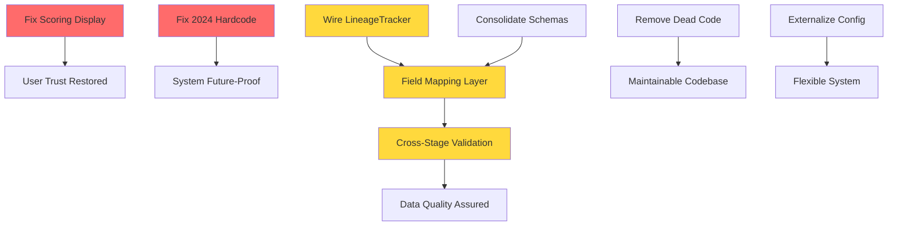

# Risk Register

### What Breaks If We Don't Fix?

| Issue | Risk if Unfixed | Timeline |
|-------|-----------------|----------|
| Scoring display bug | User makes bad decisions based on wrong scores | Already impacting |
| Hardcoded 2024 | Kill-switch filter breaks Jan 2025, no properties pass | 30 days |
| County overwrites manual data | Data loss, wasted research effort | Ongoing |
| Dead code | New developers confused, bugs hidden in unused code | Chronic |
| Duplicate schemas | Changes applied to one copy but not others, sync bugs | Chronic |
| Unused LineageTracker | False confidence in data quality, no audit trail | Chronic |
| Hardcoded buyer criteria | Can't adapt to new buyers, inflexible system | Chronic |

### Dependencies Between Fixes

**Key Dependencies:**
1. **Field Mapping Layer requires Schema Consolidation** - Can't map fields if schema definitions inconsistent
2. **Cross-Stage Validation requires LineageTracker** - Need to know field sources to validate properly
3. **Dead Code Removal blocks nothing** - Can proceed in parallel with other work

**Safe Parallel Work:**
- Scoring display fix + Dead code removal + Config cleanup (no dependencies)

**Must Be Sequential:**
- Schema consolidation → Field mapping → Cross-stage validation

---

