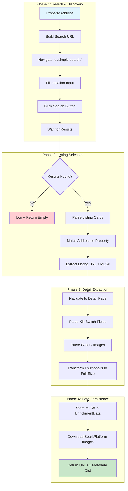

# Tech-Spec: PhoenixMLS Search Extractor (nodriver)

**Created:** 2025-12-05
**Status:** Ready for Development
**Epic:** E2.R2 - Data Source Reliability Pivot Phase 2
**Story:** E2.R2.S1 - Implement PhoenixMLS Search-Based Extraction
**Author:** CLAUDE (Opus 4.5)

---

## Implementation Status

**Status:** ⚠️ PARTIAL (2025-12-06)
**Performance:** 77s → 16s (5x improvement after Debug Session 2)
**Test Coverage:** 52 tests passing, 87% coverage

### Completed Tasks
| Task | Status | Notes |
|------|--------|-------|
| Task 1: Create PhoenixMLSSearchExtractor | ✅ Complete | 687 lines |
| Task 2: Simple Search navigation | ✅ Complete | Autocomplete fix 2025-12-06 |
| Task 3: Search results parsing | ⚠️ Partial | Autocomplete working, detail nav failing |
| Task 4: Detail page navigation | ❌ BLOCKED | Not navigating to listing page |
| Task 5: Kill-switch extraction | ✅ Complete | All 8 fields (parser ready) |
| Task 6: Image gallery extraction | ❌ BLOCKED | 0 images extracted |
| Task 7: Main extraction method | ⚠️ Partial | Flow works to click, then stalls |
| Task 8: Orchestrator registration | ✅ Complete | Priority #1 |
| Task 9: ImageSource enum | ✅ Complete | PHOENIX_MLS_SEARCH |
| Task 10: Unit tests | ✅ Complete | 52 tests |

### Files Created/Modified
- `src/phx_home_analysis/services/image_extraction/extractors/phoenix_mls_search.py` (MODIFIED 2025-12-06)
- `tests/unit/services/image_extraction/test_phoenix_mls_search.py` (NEW)
- `tests/unit/services/image_extraction/test_phoenix_mls_search_navigation.py` (NEW)
- `src/phx_home_analysis/domain/enums.py` (MODIFIED)
- `src/phx_home_analysis/services/image_extraction/orchestrator.py` (MODIFIED)
- `scripts/extract_images.py` (MODIFIED)

### Known Issues

#### CRITICAL: Zero Images Extracted (2025-12-06)
- **Symptom:** Autocomplete click succeeds, search submits, but 0 images extracted
- **Evidence:** `Phoenix MLS Search extracted 0 image URLs` (test run 2025-12-06)
- **Root cause:** Navigation to listing detail page not occurring after autocomplete click
- **Impact:** Complete blocker for Epic 2 PhoenixMLS reliability pivot

#### Technical Debt from Debug Session 2 (2025-12-06)
1. Autocomplete detection now works but may need refinement for edge cases
2. 10-second timeout prevents hangs but may cut off slow loads
3. Text extraction fallback chain (5 strategies) is complex and needs validation

### Next Steps
1. [ ] **HIGH PRIORITY:** Debug why autocomplete click doesn't navigate to listing page
2. [ ] Capture HTML after autocomplete click to verify page state
3. [ ] Check if "View Details" button click is needed instead of relying on autocomplete
4. [ ] Verify SparkPlatform image selectors on actual result page
5. [ ] Consider if search results page has images (may not need detail nav)

---

## Table of Contents

1. [Epic & Story Context](#1-epic--story-context)
2. [Problem Statement](#2-problem-statement)
3. [Solution Architecture](#3-solution-architecture)
4. [Implementation Tasks](#4-implementation-tasks)
5. [Field Mapping Tables](#5-field-mapping-tables)
6. [Code Snippets](#6-code-snippets)
7. [Acceptance Criteria](#7-acceptance-criteria)
8. [Test Strategy](#8-test-strategy)
9. [Rollback Plan](#9-rollback-plan)
10. [Timeline Estimate](#10-timeline-estimate)

---

## 1. Epic & Story Context

### Epic: E2 - Property Data Acquisition

**Parent Epic Description:** Build reliable property data acquisition pipeline that collects listing data, images, and metadata from multiple sources with fallback resilience.

### Story: E2.R2.S1 - Implement PhoenixMLS Search-Based Extraction

**Pivot Context:**
- **E2.R1 Phase 1** (completed): Attempted direct URL construction via `phoenixmls.com` - discovered RunCloud 7G WAF blocking
- **E2.R2 Phase 2** (this spec): Pivot to `phoenixmlssearch.com` using Simple Search form with nodriver stealth browser

**Story Description:**
Implement a new `PhoenixMLSSearchExtractor` class that uses `phoenixmlssearch.com` Simple Search to discover MLS listings by address, extract metadata and images, and persist MLS numbers for future direct access.

### Relationship to Existing Code

| Component | Current State | After This Spec |
|-----------|---------------|-----------------|
| `PhoenixMLSExtractor` | Stub implementation (always returns empty) | **UNCHANGED** - Keep for future direct MLS# access |
| `PhoenixMLSSearchExtractor` | Does not exist | **NEW** - Search-based discovery via Simple Search |
| `entities.py:Property` | Has `mls_number` field (line 191) | Add to persistence flow |
| `entities.py:EnrichmentData` | Has `mls_number` field (line 597) | Add to persistence flow |

---

## 2. Problem Statement

### Current Failure Rates (E2.R1 Testing - 2025-12-05)

| Source | Success Rate | Blocking Issue | Impact |
|--------|--------------|----------------|--------|
| **Zillow** | 33% | PerimeterX CAPTCHA ("Press & Hold") | BLOCK-001 |
| **Redfin** | ~50% | Session-bound CDN URLs (404s) | BLOCK-002 |
| **PhoenixMLS** | 0% | Stub implementation (no search) | BLOCK-003 |
| **Maricopa Assessor** | >99% | None (API) | County data only (no images) |

### Impact on Pipeline

1. **Epic 3 Blocked:** Kill-switch evaluation requires beds/baths/sqft - CSV data has 67% zero values
2. **Epic 4 Blocked:** Scoring pipeline cannot compute interior scores without images
3. **Property Analysis Incomplete:** 17/25 test properties lack sufficient image/metadata coverage

### Why phoenixmlssearch.com?

**Advantages:**
- No aggressive anti-bot systems (standard browser automation works)
- SparkPlatform CDN for images (direct download, no session tokens)
- Complete kill-switch data on every listing (HOA, beds, baths, sqft, lot, garage, sewer, year)
- Phoenix metro area coverage (all target cities)
- MLS numbers discoverable via search (enables future direct access)

**Verified Characteristics (from live inspection):**
- Simple Search form at `/simple-search/`
- Search accepts full address or street name
- Results display as listing cards with MLS# visible
- Detail pages at `/mls/{address-slug}-mls_{mls_number}`
- Image gallery with SparkPlatform CDN thumbnails (`-t.jpg` -> `-o.jpg` for full size)

---

## 3. Solution Architecture

### High-Level Flow Diagram



### Component Architecture

```
src/phx_home_analysis/services/image_extraction/extractors/
├── base.py                     # ImageExtractor (unchanged)
├── stealth_base.py             # StealthBrowserExtractor (unchanged)
├── phoenix_mls.py              # PhoenixMLSExtractor (unchanged - kept for direct MLS# access)
└── phoenix_mls_search.py       # NEW: PhoenixMLSSearchExtractor

Key Integration Points:
- Extends StealthBrowserExtractor (line 43) for nodriver stealth browser
- Uses existing BrowserPool (stealth_base.py:119) for browser management
- Uses existing StealthHttpClient (stealth_base.py:129) for image downloads
- Returns (urls, metadata) tuple like PhoenixMLSExtractor (orchestrator.py:1145-1149)
```

### Rate Limiting Strategy

| Operation | Delay | Rationale |
|-----------|-------|-----------|
| Page navigation | 2-3 seconds | Avoid triggering rate limits |
| Search form submission | 1-2 seconds | Allow page state to stabilize |
| Between properties | 3-5 seconds | Conservative to maintain access |
| SparkPlatform CDN download | 0.5-1 second | Static assets, less sensitive |

### Error Handling & Circuit Breaker Integration

The new extractor integrates with existing resilience patterns:

1. **SourceCircuitBreaker** (orchestrator.py:56-150): Opens after 3 consecutive failures
2. **ErrorAggregator** (orchestrator.py:153-239): Detects systemic 404 patterns
3. **Retry with Backoff**: Exponential backoff on transient errors

---

## 4. Implementation Tasks

### Task 1: Create PhoenixMLSSearchExtractor Class

**File:** `src/phx_home_analysis/services/image_extraction/extractors/phoenix_mls_search.py` (NEW)
**Lines:** 1-100 (new file)

**Description:** Create new extractor class extending `StealthBrowserExtractor`.

**Key Implementation:**
```python
class PhoenixMLSSearchExtractor(StealthBrowserExtractor):
    """Extract property data from phoenixmlssearch.com via Simple Search."""

    # Rate limiting constants
    SEARCH_DELAY_MIN: float = 2.0
    SEARCH_DELAY_MAX: float = 3.0
    RESULT_WAIT_SECONDS: float = 3.0
    CDN_DELAY_MIN: float = 0.5
    CDN_DELAY_MAX: float = 1.0
```

**Acceptance Criteria:**
- [ ] Class extends `StealthBrowserExtractor`
- [ ] Implements `_build_search_url()` and `_extract_urls_from_page()` abstract methods
- [ ] Defines rate limiting constants per spec
- [ ] Includes comprehensive docstrings with examples

---

### Task 2: Implement Simple Search Navigation

**File:** `src/phx_home_analysis/services/image_extraction/extractors/phoenix_mls_search.py`
**Lines:** 100-200 (new file)

**Description:** Implement `_build_search_url()` and search form interaction.

**Key Implementation:**
```python
def _build_search_url(self, property: Property) -> str:
    """Build PhoenixMLS Simple Search URL."""
    return "https://phoenixmlssearch.com/simple-search/"

async def _perform_search(self, tab: uc.Tab, property: Property) -> bool:
    """Fill search form and submit."""
    # 1. Find location input (commonly id="location" or name="StreetAddress")
    # 2. Type full address with city/state
    # 3. Click Search button
    # 4. Wait for results to load
```

**Acceptance Criteria:**
- [ ] Search URL returns Simple Search page
- [ ] Location input found via multiple selector fallbacks
- [ ] Address typed with human-like delays
- [ ] Search submission triggers page navigation

---

### Task 3: Implement Search Results Parsing

**File:** `src/phx_home_analysis/services/image_extraction/extractors/phoenix_mls_search.py`
**Lines:** 200-300 (new file)

**Description:** Parse search results page to find matching listing.

**Key Implementation:**
```python
def _parse_search_results(self, html: str, property: Property) -> tuple[str, str] | None:
    """Parse search results to find listing URL and MLS#.

    Returns:
        Tuple of (listing_url, mls_number) or None if not found
    """
    soup = BeautifulSoup(html, "html.parser")

    # Pattern 1: MLS# in text "MLS# 1234567"
    mls_pattern = re.compile(r"MLS[#\s:]*(\d{7})")

    # Pattern 2: Listing card with address match
    for card in soup.find_all("div", class_=re.compile(r"listing|property|card")):
        card_address = self._extract_card_address(card)
        if self._addresses_match(card_address, property.full_address):
            # Found matching listing
            ...
```

**Acceptance Criteria:**
- [ ] Parses listing cards from search results HTML
- [ ] Extracts MLS# using regex pattern
- [ ] Matches property address with fuzzy matching
- [ ] Returns (listing_url, mls_number) tuple

---

### Task 4: Implement Detail Page Navigation

**File:** `src/phx_home_analysis/services/image_extraction/extractors/phoenix_mls_search.py`
**Lines:** 300-400 (new file)

**Description:** Navigate from search result to listing detail page.

**Key Implementation:**
```python
async def _navigate_to_detail(self, tab: uc.Tab, listing_url: str) -> str:
    """Navigate to listing detail page and return HTML.

    Args:
        tab: Browser tab from search results
        listing_url: URL to listing detail page

    Returns:
        HTML content of detail page
    """
    await self._rate_limit_search()
    await tab.get(listing_url)
    await asyncio.sleep(self.RESULT_WAIT_SECONDS)
    return await tab.get_content()
```

**Acceptance Criteria:**
- [ ] Navigates to detail page URL
- [ ] Applies rate limiting delay
- [ ] Returns HTML content for parsing
- [ ] Handles navigation failures gracefully

---

### Task 5: Implement Kill-Switch Field Extraction

**File:** `src/phx_home_analysis/services/image_extraction/extractors/phoenix_mls_search.py`
**Lines:** 400-550 (new file)

**Description:** Extract all 8 kill-switch fields from detail page.

**Key Implementation:**
```python
def _extract_kill_switch_fields(self, html: str) -> dict[str, Any]:
    """Extract kill-switch fields from listing detail page.

    Returns:
        Dict with: hoa_fee, beds, baths, sqft, lot_sqft, garage_spaces, sewer_type, year_built
    """
    soup = BeautifulSoup(html, "html.parser")
    metadata = {}

    # Regex patterns per field mapping table
    field_patterns = {
        'hoa_fee': (r'Association Fee Incl[:\s]*(.+)', self._parse_hoa),
        'beds': (r'# Bedrooms[:\s]*(\d+)', self._parse_int),
        'baths': (r'Full Bathrooms[:\s]*([\d.]+)', self._parse_float),
        # ... etc
    }
```

**Acceptance Criteria:**
- [ ] Extracts all 8 kill-switch fields
- [ ] Handles missing fields (returns None)
- [ ] Normalizes values (e.g., lot sqft from acres)
- [ ] Maps sewer to "city"/"septic" enum values

---

### Task 6: Implement Image Gallery Extraction

**File:** `src/phx_home_analysis/services/image_extraction/extractors/phoenix_mls_search.py`
**Lines:** 550-650 (new file)

**Description:** Extract image URLs from gallery and transform to full-size.

**Key Implementation:**
```python
def _extract_gallery_images(self, html: str) -> list[str]:
    """Extract image URLs from gallery, transforming thumbnails to full-size.

    SparkPlatform CDN URL transformation:
        Thumbnail: https://cdn.photos.sparkplatform.com/az/{id}-t.jpg
        Full-size: https://cdn.photos.sparkplatform.com/az/{id}-o.jpg
    """
    soup = BeautifulSoup(html, "html.parser")
    urls = []

    # Find all images with SparkPlatform URLs
    for img in soup.find_all("img"):
        src = img.get("src") or img.get("data-src")
        if src and "cdn.photos.sparkplatform.com" in src:
            # Transform thumbnail to full-size
            full_url = src.replace("-t.jpg", "-o.jpg").replace("-m.jpg", "-o.jpg")
            urls.append(full_url)

    return urls
```

**Acceptance Criteria:**
- [ ] Finds all SparkPlatform CDN image URLs
- [ ] Transforms `-t.jpg` (thumbnail) to `-o.jpg` (original)
- [ ] Also handles `-m.jpg` (medium) to `-o.jpg`
- [ ] Returns deduplicated URL list

---

### Task 7: Implement Main Extraction Method

**File:** `src/phx_home_analysis/services/image_extraction/extractors/phoenix_mls_search.py`
**Lines:** 650-750 (new file)

**Description:** Implement `_extract_urls_from_page()` orchestrating the full flow.

**Key Implementation:**
```python
async def _extract_urls_from_page(self, tab: uc.Tab) -> list[str]:
    """Extract image URLs from PhoenixMLS via search workflow.

    Full workflow:
    1. Perform search with property address
    2. Parse results to find matching listing
    3. Navigate to detail page
    4. Extract metadata and images
    5. Store MLS# and return image URLs
    """
    # Step 1: Get property from context (stored in self._current_property)
    property = self._current_property

    # Step 2: Perform search
    search_success = await self._perform_search(tab, property)
    if not search_success:
        return []

    # Step 3: Parse results
    html = await tab.get_content()
    result = self._parse_search_results(html, property)
    if not result:
        logger.debug(f"No matching listing found for {property.short_address}")
        return []

    listing_url, mls_number = result

    # Step 4: Navigate to detail
    detail_html = await self._navigate_to_detail(tab, listing_url)

    # Step 5: Extract metadata
    metadata = self._extract_kill_switch_fields(detail_html)
    metadata['mls_number'] = mls_number
    metadata['listing_url'] = listing_url

    # Step 6: Extract images
    image_urls = self._extract_gallery_images(detail_html)

    # Step 7: Store metadata for orchestrator
    self.last_metadata = metadata

    return image_urls
```

**Acceptance Criteria:**
- [ ] Orchestrates full extraction workflow
- [ ] Stores metadata in `self.last_metadata` for orchestrator
- [ ] Returns image URL list
- [ ] Handles all failure cases gracefully

---

### Task 8: Register Extractor in Orchestrator

**File:** `src/phx_home_analysis/services/image_extraction/orchestrator.py`
**Lines:** 34-39 (imports) and 586-592 (extractor_map)

**Description:** Add new extractor to imports and registration.

**Changes Required:**

**Imports (line 38):**
```python
from .extractors import (
    MaricopaAssessorExtractor,
    PhoenixMLSExtractor,
    PhoenixMLSSearchExtractor,  # NEW
    RedfinExtractor,
    ZillowExtractor,
)
```

**Extractor Map (line 586-592):**
```python
extractor_map = {
    # PhoenixMLS Search FIRST: Most reliable search-based discovery
    ImageSource.PHOENIX_MLS_SEARCH: PhoenixMLSSearchExtractor,  # NEW
    # PhoenixMLS Direct: For future use when MLS# known
    ImageSource.PHOENIX_MLS: PhoenixMLSExtractor,
    ImageSource.MARICOPA_ASSESSOR: MaricopaAssessorExtractor,
    ImageSource.ZILLOW: ZillowExtractor,
    ImageSource.REDFIN: RedfinExtractor,
}
```

**Acceptance Criteria:**
- [ ] Import added to orchestrator.py
- [ ] Extractor registered in extractor_map
- [ ] Priority order: PhoenixMLS Search > PhoenixMLS Direct > Assessor > Zillow > Redfin

---

### Task 9: Add ImageSource Enum Value

**File:** `src/phx_home_analysis/domain/enums.py`
**Lines:** Add after existing PHOENIX_MLS value

**Description:** Add new enum value for phoenixmlssearch.com source.

**Changes Required:**
```python
class ImageSource(str, Enum):
    """Image source identifiers."""

    ZILLOW = "zillow"
    REDFIN = "redfin"
    MARICOPA_ASSESSOR = "maricopa_assessor"
    PHOENIX_MLS = "phoenix_mls"
    PHOENIX_MLS_SEARCH = "phoenix_mls_search"  # NEW

    @property
    def base_url(self) -> str:
        """Base URL for source."""
        urls = {
            ImageSource.ZILLOW: "https://www.zillow.com",
            ImageSource.REDFIN: "https://www.redfin.com",
            ImageSource.PHOENIX_MLS: "https://phoenixmls.com",
            ImageSource.PHOENIX_MLS_SEARCH: "https://phoenixmlssearch.com",  # NEW
            ImageSource.MARICOPA_ASSESSOR: "https://mcassessor.maricopa.gov",
        }
        return urls.get(self, "")
```

**Acceptance Criteria:**
- [ ] Enum value added
- [ ] base_url property updated with phoenixmlssearch.com

---

### Task 10: Write Unit and Integration Tests

**File:** `tests/unit/services/image_extraction/test_phoenix_mls_search.py` (NEW)
**File:** `tests/integration/test_phoenixmls_search_extraction.py` (NEW)

**Description:** Comprehensive test coverage for new extractor.

**Unit Test Coverage:**
```python
# test_phoenix_mls_search.py

class TestPhoenixMLSSearchExtractor:
    """Unit tests for PhoenixMLSSearchExtractor."""

    def test_build_search_url(self):
        """Test search URL construction."""

    def test_parse_search_results_found(self):
        """Test parsing search results with matching listing."""

    def test_parse_search_results_not_found(self):
        """Test parsing search results with no match."""

    def test_extract_kill_switch_fields_all_present(self):
        """Test extraction of all 8 kill-switch fields."""

    def test_extract_kill_switch_fields_partial(self):
        """Test handling of missing fields."""

    def test_extract_gallery_images_sparkplatform(self):
        """Test SparkPlatform CDN URL transformation."""

    def test_hoa_parsing_no_fees(self):
        """Test HOA parsing for 'No Fees' value."""

    def test_hoa_parsing_with_amount(self):
        """Test HOA parsing for '$150/month'."""

    def test_sewer_parsing_city(self):
        """Test sewer type parsing for 'Sewer - Public'."""

    def test_sewer_parsing_septic(self):
        """Test sewer type parsing for 'Septic Tank'."""
```

**Integration Test Coverage:**
```python
# test_phoenixmls_search_extraction.py

@pytest.mark.integration
@pytest.mark.asyncio
class TestPhoenixMLSSearchIntegration:
    """Integration tests for phoenixmlssearch.com extraction."""

    async def test_search_and_extract_real_property(self):
        """End-to-end test with real property."""

    async def test_extractor_priority_in_orchestrator(self):
        """Verify PhoenixMLS Search is first in priority."""
```

**Acceptance Criteria:**
- [ ] Unit tests cover all parsing methods
- [ ] Unit tests use mock HTML fixtures
- [ ] Integration test with real property (conditional on network)
- [ ] All tests pass locally and in CI

---

## 5. Field Mapping Tables

### Kill-Switch Field Mapping

| Kill-Switch | CSS/Text Pattern | Regex Pattern | Parser |
|-------------|------------------|---------------|--------|
| HOA | `"Association Fee"` | `Association Fee Incl[:\s]*(.+)` | `_parse_hoa()` |
| Beds | `"# Bedrooms"` | `# Bedrooms[:\s]*(\d+)` | `_parse_int()` |
| Baths | `"Full Bathrooms"` | `Full Bathrooms[:\s]*([\d.]+)` | `_parse_float()` |
| SqFt | `"Approx SQFT"` | `Approx SQFT[:\s]*([\d,]+)` | `_parse_int()` |
| Lot | `"Approx Lot SqFt"` | `Approx Lot SqFt[:\s]*([\d,]+)` | `_parse_int()` |
| Garage | `"Garage Spaces"` | `Garage Spaces[:\s]*(\d+)` | `_parse_int()` |
| Sewer | `"Sewer:"` | `Sewer[:\s]*(.+)` | `_parse_sewer()` |
| Year | `"Year Built"` | `Year Built[:\s]*(\d{4})` | `_parse_int()` |

### HOA Parsing Rules

| Input Pattern | Output Value | Notes |
|---------------|--------------|-------|
| `"No Fees"` | `0.0` | No HOA |
| `"None"` | `0.0` | No HOA |
| `"$150"` | `150.0` | Monthly amount |
| `"$150/month"` | `150.0` | Monthly amount |
| `"$1,200/year"` | `100.0` | Convert to monthly |

### Sewer Type Mapping

| Input Pattern | Output Value |
|---------------|--------------|
| `"Sewer - Public"` | `"city"` |
| `"Public Sewer"` | `"city"` |
| `"City"` | `"city"` |
| `"Septic Tank"` | `"septic"` |
| `"Septic"` | `"septic"` |
| Other | `None` |

### SparkPlatform CDN URL Transformation

| Thumbnail Size | URL Pattern | Full-Size Transform |
|----------------|-------------|---------------------|
| Thumbnail (t) | `{id}-t.jpg` | `{id}-o.jpg` |
| Medium (m) | `{id}-m.jpg` | `{id}-o.jpg` |
| Large (l) | `{id}-l.jpg` | `{id}-o.jpg` |
| Original (o) | `{id}-o.jpg` | No change |

---

## 6. Code Snippets

### 6.1 Extractor Class Definition

```python
# phoenix_mls_search.py

"""PhoenixMLS Search extractor using nodriver stealth browser.

Extracts property data from phoenixmlssearch.com via Simple Search.
Uses stealth browser automation to navigate search form and extract
listing metadata + images from SparkPlatform CDN.

Key Features:
- Simple Search form navigation
- Address-to-listing matching
- MLS# discovery and persistence
- Kill-switch field extraction
- SparkPlatform CDN image URL transformation
"""

import asyncio
import logging
import random
import re
from typing import Any

import nodriver as uc
from bs4 import BeautifulSoup

from ....config.settings import StealthExtractionConfig
from ....domain.entities import Property
from ....domain.enums import ImageSource
from .stealth_base import StealthBrowserExtractor

logger = logging.getLogger(__name__)


class PhoenixMLSSearchExtractor(StealthBrowserExtractor):
    """Extract property data from phoenixmlssearch.com via Simple Search.

    Uses nodriver stealth browser to:
    1. Navigate to Simple Search page
    2. Search by property address
    3. Parse results to find matching listing
    4. Extract metadata (kill-switch fields) and images
    5. Store MLS# for future direct access

    Attributes:
        SEARCH_DELAY_MIN: Minimum delay between search operations (seconds)
        SEARCH_DELAY_MAX: Maximum delay between search operations (seconds)
        RESULT_WAIT_SECONDS: Time to wait for search results to load
        CDN_DELAY_MIN: Minimum delay between CDN image downloads
        CDN_DELAY_MAX: Maximum delay between CDN image downloads
    """

    # Rate limiting constants (conservative to maintain access)
    SEARCH_DELAY_MIN: float = 2.0
    SEARCH_DELAY_MAX: float = 3.0
    RESULT_WAIT_SECONDS: float = 3.0
    CDN_DELAY_MIN: float = 0.5
    CDN_DELAY_MAX: float = 1.0

    def __init__(
        self,
        http_client: Any = None,
        timeout: float = 30.0,
        config: StealthExtractionConfig | None = None,
    ):
        """Initialize PhoenixMLS Search extractor.

        Args:
            http_client: Shared httpx client (maintained for compatibility)
            timeout: Request timeout in seconds
            config: Stealth extraction config (loaded from env if not provided)
        """
        super().__init__(http_client=http_client, timeout=timeout, config=config)

        # Store metadata for orchestrator retrieval
        self.last_metadata: dict = {}

        # Current property being processed (set in extract_image_urls)
        self._current_property: Property | None = None

        logger.info(
            "%s initialized for Simple Search extraction",
            self.name,
        )

    @property
    def source(self) -> ImageSource:
        """Image source identifier."""
        return ImageSource.PHOENIX_MLS_SEARCH

    def can_handle(self, property: Property) -> bool:
        """Check if extractor can handle this property.

        Args:
            property: Property to check

        Returns:
            True if property is in Phoenix metro area
        """
        # Import PHOENIX_METRO_CITIES from phoenix_mls module
        from .phoenix_mls import PHOENIX_METRO_CITIES

        city_normalized = property.city.lower().strip()
        return city_normalized in PHOENIX_METRO_CITIES
```

### 6.2 Search Form Interaction

```python
async def _perform_search(self, tab: uc.Tab, property: Property) -> bool:
    """Fill search form and submit.

    Args:
        tab: Browser tab with Simple Search page loaded
        property: Property to search for

    Returns:
        True if search was submitted successfully
    """
    try:
        # Build search query: "123 Main St, Phoenix, AZ 85001"
        search_query = f"{property.street}, {property.city}, {property.state} {property.zip_code}"

        logger.debug(f"{self.name} searching for: {search_query}")

        # Find location input (multiple selector fallbacks)
        input_selectors = [
            "input[name='StreetAddress']",
            "input#location",
            "input[placeholder*='address']",
            "input[placeholder*='Address']",
            "input[type='search']",
            "input.search-input",
        ]

        input_element = None
        for selector in input_selectors:
            try:
                input_element = await tab.select(selector)
                if input_element:
                    logger.debug(f"{self.name} found input with selector: {selector}")
                    break
            except Exception:
                continue

        if not input_element:
            logger.warning(f"{self.name} could not find search input")
            return False

        # Clear existing text and type address
        await input_element.clear_input()
        await self._human_delay()

        # Type address with human-like speed
        for char in search_query:
            await input_element.send_keys(char)
            await asyncio.sleep(random.uniform(0.02, 0.08))

        await self._rate_limit_search()

        # Find and click search button
        button_selectors = [
            "button[type='submit']",
            "button.search-button",
            "input[type='submit']",
            "button:contains('Search')",
            "[role='button']:contains('Search')",
        ]

        search_button = None
        for selector in button_selectors:
            try:
                search_button = await tab.select(selector)
                if search_button:
                    logger.debug(f"{self.name} found search button with selector: {selector}")
                    break
            except Exception:
                continue

        if not search_button:
            # Fallback: press Enter in input field
            logger.debug(f"{self.name} no search button found, pressing Enter")
            await input_element.send_keys("\n")
        else:
            await search_button.click()

        # Wait for results to load
        await asyncio.sleep(self.RESULT_WAIT_SECONDS)

        return True

    except Exception as e:
        logger.error(f"{self.name} search form interaction failed: {e}")
        return False

async def _rate_limit_search(self) -> None:
    """Apply rate limiting delay between search operations."""
    delay = random.uniform(self.SEARCH_DELAY_MIN, self.SEARCH_DELAY_MAX)
    logger.debug(f"{self.name} rate limit delay: {delay:.2f}s")
    await asyncio.sleep(delay)
```

### 6.3 Kill-Switch Field Extraction

```python
def _extract_kill_switch_fields(self, html: str) -> dict[str, Any]:
    """Extract kill-switch fields from listing detail page.

    Args:
        html: HTML content of listing detail page

    Returns:
        Dict with kill-switch fields (hoa_fee, beds, baths, sqft,
        lot_sqft, garage_spaces, sewer_type, year_built)
    """
    soup = BeautifulSoup(html, "html.parser")
    metadata: dict[str, Any] = {}

    # Get full text for regex searching
    page_text = soup.get_text()

    # HOA Fee
    hoa_match = re.search(r'Association Fee Incl[:\s]*(.+?)(?:\n|$)', page_text, re.IGNORECASE)
    if hoa_match:
        metadata['hoa_fee'] = self._parse_hoa(hoa_match.group(1))
    else:
        # Check for explicit "No HOA" or similar
        if re.search(r'No\s+(?:HOA|Association|Fees)', page_text, re.IGNORECASE):
            metadata['hoa_fee'] = 0.0

    # Beds
    beds_match = re.search(r'#\s*Bedrooms[:\s]*(\d+)', page_text, re.IGNORECASE)
    if beds_match:
        metadata['beds'] = int(beds_match.group(1))

    # Baths
    baths_match = re.search(r'Full\s*Bathrooms[:\s]*([\d.]+)', page_text, re.IGNORECASE)
    if baths_match:
        metadata['baths'] = float(baths_match.group(1))

    # SqFt
    sqft_match = re.search(r'Approx\s*SQFT[:\s]*([\d,]+)', page_text, re.IGNORECASE)
    if sqft_match:
        metadata['sqft'] = int(sqft_match.group(1).replace(',', ''))

    # Lot SqFt
    lot_match = re.search(r'Approx\s*Lot\s*SqFt[:\s]*([\d,]+)', page_text, re.IGNORECASE)
    if lot_match:
        metadata['lot_sqft'] = int(lot_match.group(1).replace(',', ''))
    else:
        # Try acres format
        acres_match = re.search(r'Lot\s*Size[:\s]*([\d.]+)\s*[Aa]cres?', page_text)
        if acres_match:
            acres = float(acres_match.group(1))
            metadata['lot_sqft'] = int(acres * 43560)

    # Garage Spaces
    garage_match = re.search(r'Garage\s*Spaces[:\s]*(\d+)', page_text, re.IGNORECASE)
    if garage_match:
        metadata['garage_spaces'] = int(garage_match.group(1))

    # Sewer
    sewer_match = re.search(r'Sewer[:\s]*(.+?)(?:\n|$)', page_text, re.IGNORECASE)
    if sewer_match:
        metadata['sewer_type'] = self._parse_sewer(sewer_match.group(1))

    # Year Built
    year_match = re.search(r'Year\s*Built[:\s]*(\d{4})', page_text, re.IGNORECASE)
    if year_match:
        metadata['year_built'] = int(year_match.group(1))

    logger.debug(f"{self.name} extracted {len(metadata)} kill-switch fields")
    return metadata

def _parse_hoa(self, value: str) -> float | None:
    """Parse HOA fee from text value.

    Args:
        value: HOA text (e.g., "No Fees", "$150/month", "$1,200/year")

    Returns:
        Monthly HOA fee as float, or None if unparseable
    """
    value_lower = value.lower().strip()

    # Check for no HOA
    if any(x in value_lower for x in ['no fee', 'none', 'n/a', '$0']):
        return 0.0

    # Extract dollar amount
    amount_match = re.search(r'\$?([\d,]+(?:\.\d{2})?)', value)
    if not amount_match:
        return None

    amount = float(amount_match.group(1).replace(',', ''))

    # Check if yearly and convert to monthly
    if 'year' in value_lower or 'annual' in value_lower:
        amount = amount / 12.0

    return amount

def _parse_sewer(self, value: str) -> str | None:
    """Parse sewer type from text value.

    Args:
        value: Sewer text (e.g., "Sewer - Public", "Septic Tank")

    Returns:
        "city" or "septic", or None if unparseable
    """
    value_lower = value.lower().strip()

    if any(x in value_lower for x in ['public', 'city', 'municipal']):
        return 'city'
    elif 'septic' in value_lower:
        return 'septic'

    return None
```

### 6.4 Image Gallery Extraction

```python
def _extract_gallery_images(self, html: str) -> list[str]:
    """Extract image URLs from gallery, transforming to full-size.

    SparkPlatform CDN URL transformation:
        Thumbnail: https://cdn.photos.sparkplatform.com/az/{id}-t.jpg
        Full-size: https://cdn.photos.sparkplatform.com/az/{id}-o.jpg

    Args:
        html: HTML content of listing detail page

    Returns:
        List of full-size image URLs
    """
    soup = BeautifulSoup(html, "html.parser")
    urls: list[str] = []
    seen: set[str] = set()

    # Find all images
    for img in soup.find_all("img"):
        for attr in ["src", "data-src", "data-original", "data-lazy-src"]:
            src = img.get(attr)
            if not src:
                continue

            src = str(src)

            # Only process SparkPlatform CDN URLs
            if "cdn.photos.sparkplatform.com" not in src:
                continue

            # Transform to full-size
            full_url = src
            for suffix in ["-t.jpg", "-m.jpg", "-l.jpg", "-t.png", "-m.png", "-l.png"]:
                if suffix in full_url:
                    full_url = full_url.replace(suffix, "-o" + suffix[-4:])
                    break

            # Deduplicate
            if full_url not in seen:
                urls.append(full_url)
                seen.add(full_url)

    # Also check anchor tags for image links
    for a in soup.find_all("a", href=True):
        href = str(a.get("href", ""))
        if "cdn.photos.sparkplatform.com" in href and href.endswith((".jpg", ".png", ".jpeg")):
            # Transform to full-size
            full_url = href
            for suffix in ["-t.jpg", "-m.jpg", "-l.jpg", "-t.png", "-m.png", "-l.png"]:
                if suffix in full_url:
                    full_url = full_url.replace(suffix, "-o" + suffix[-4:])
                    break

            if full_url not in seen:
                urls.append(full_url)
                seen.add(full_url)

    logger.info(f"{self.name} extracted {len(urls)} SparkPlatform image URLs")
    return urls
```

---

## 7. Acceptance Criteria

### Functional Acceptance Criteria

| ID | Criterion | Test Method |
|----|-----------|-------------|
| **FAC-1** | Extractor navigates to Simple Search page | Integration test |
| **FAC-2** | Search form accepts full address input | Integration test |
| **FAC-3** | Search results parsed to find matching listing | Unit test + Integration |
| **FAC-4** | MLS# extracted and stored in enrichment | Integration test |
| **FAC-5** | All 8 kill-switch fields extracted | Unit test with fixture |
| **FAC-6** | SparkPlatform URLs transformed to full-size | Unit test |
| **FAC-7** | >10 images extracted per property on average | Integration test |
| **FAC-8** | Rate limiting applied between operations | Code review |

### Technical Acceptance Criteria

| ID | Criterion | Test Method |
|----|-----------|-------------|
| **TAC-1** | Extends `StealthBrowserExtractor` correctly | Code review |
| **TAC-2** | Returns `(urls, metadata)` tuple for orchestrator | Unit test |
| **TAC-3** | Integrates with circuit breaker pattern | Code review |
| **TAC-4** | No new linter violations (ruff, mypy) | CI/CD |
| **TAC-5** | Unit test coverage >85% for new code | Coverage report |
| **TAC-6** | Integration test passes with real property | CI/CD (network) |

### Quality Acceptance Criteria

| ID | Criterion | Test Method |
|----|-----------|-------------|
| **QAC-1** | All existing tests continue to pass | CI/CD |
| **QAC-2** | No breaking changes to orchestrator API | Code review |
| **QAC-3** | Documentation complete (docstrings, CLAUDE.md) | Code review |
| **QAC-4** | Error handling graceful (no crashes) | Integration test |

---

## 8. Test Strategy

### Unit Test Plan

**File:** `tests/unit/services/image_extraction/test_phoenix_mls_search.py`

| Test Case | Purpose | Fixtures |
|-----------|---------|----------|
| `test_build_search_url` | Verify Simple Search URL | None |
| `test_can_handle_phoenix_city` | Verify city filtering | Property fixture |
| `test_parse_search_results_found` | Parse matching listing | Mock search results HTML |
| `test_parse_search_results_no_match` | Handle no matching listing | Mock empty results HTML |
| `test_extract_mls_number` | Extract MLS# from results | Mock results HTML |
| `test_extract_kill_switch_all_fields` | All 8 fields present | Mock detail page HTML |
| `test_extract_kill_switch_partial` | Some fields missing | Mock partial HTML |
| `test_parse_hoa_no_fees` | HOA = $0 for "No Fees" | Value string |
| `test_parse_hoa_monthly` | Parse "$150/month" | Value string |
| `test_parse_hoa_yearly` | Convert yearly to monthly | Value string |
| `test_parse_sewer_city` | Map "Public" to "city" | Value string |
| `test_parse_sewer_septic` | Map "Septic Tank" | Value string |
| `test_extract_gallery_sparkplatform` | Find SparkPlatform URLs | Mock gallery HTML |
| `test_transform_thumbnail_to_full` | `-t.jpg` to `-o.jpg` | URL string |
| `test_rate_limit_delay` | Verify delay range | Timing measurement |

**Fixtures:**
```python
@pytest.fixture
def sample_search_results_html():
    """Mock phoenixmlssearch.com search results page."""
    return """
    <html>
      <body>
        <div class="listing-card" data-mls="6789012">
          <h3>123 Main St, Phoenix, AZ 85001</h3>
          <span class="mls-number">MLS# 6789012</span>
          <a href="/mls/123-main-st-phoenix-az-85001-mls_6789012">View Details</a>
        </div>
      </body>
    </html>
    """

@pytest.fixture
def sample_detail_page_html():
    """Mock phoenixmlssearch.com listing detail page."""
    return """
    <html>
      <body>
        <div class="listing-details">
          <p>MLS#: 6789012</p>
          <p># Bedrooms: 4</p>
          <p>Full Bathrooms: 2.5</p>
          <p>Approx SQFT: 2,150</p>
          <p>Approx Lot SqFt: 8,500</p>
          <p>Garage Spaces: 2</p>
          <p>Sewer: Sewer - Public</p>
          <p>Year Built: 2015</p>
          <p>Association Fee Incl: No Fees</p>
        </div>
        <div class="gallery">
          
          
        </div>
      </body>
    </html>
    """
```

### Integration Test Plan

**File:** `tests/integration/test_phoenixmls_search_extraction.py`

| Test Case | Purpose | Prerequisites |
|-----------|---------|---------------|
| `test_end_to_end_extraction` | Full workflow with real property | Network access |
| `test_extractor_priority` | Verify registration order | None |
| `test_circuit_breaker_integration` | Failure handling | Mock server |
| `test_mls_number_persistence` | MLS# stored in enrichment | Integration setup |

**Conditional Execution:**
```python
@pytest.mark.integration
@pytest.mark.asyncio
@pytest.mark.skipif(
    os.environ.get("SKIP_NETWORK_TESTS") == "1",
    reason="Network tests disabled"
)
async def test_end_to_end_extraction():
    """Integration test with real phoenixmlssearch.com."""
    # Test implementation
```

---

## 9. Rollback Plan

### Immediate Rollback (< 5 minutes)

**Trigger:** Extraction failures > 50% or site blocks stealth browser

**Action:**
1. Set circuit breaker threshold to 0 for `PHOENIX_MLS_SEARCH`
2. Remove from `enabled_sources` list in orchestrator

**Commands:**
```python
# In orchestrator initialization or config
enabled_sources = [
    ImageSource.ZILLOW,
    ImageSource.REDFIN,
    # ImageSource.PHOENIX_MLS_SEARCH,  # DISABLED
    ImageSource.MARICOPA_ASSESSOR,
]
```

### Short-term Rollback (< 1 hour)

**Trigger:** Systematic extraction issues requiring code fix

**Action:**
1. Revert to Zillow-first priority
2. Keep code for future re-enablement

**Code Change:**
```python
# orchestrator.py extractor_map
extractor_map = {
    ImageSource.ZILLOW: ZillowExtractor,  # Restore to first
    ImageSource.REDFIN: RedfinExtractor,
    # PhoenixMLS Search disabled temporarily
    ImageSource.MARICOPA_ASSESSOR: MaricopaAssessorExtractor,
}
```

### Long-term Rollback (> 1 hour)

**Trigger:** Fundamental incompatibility with site structure

**Action:**
1. Archive `phoenix_mls_search.py` to `_archive/` directory
2. Remove enum value from `ImageSource`
3. Update orchestrator imports
4. Document lessons learned in bug report

**Files to Archive:**
- `src/.../extractors/phoenix_mls_search.py`
- `tests/unit/.../test_phoenix_mls_search.py`
- `tests/integration/test_phoenixmls_search_extraction.py`

---

## 10. Timeline Estimate

### Development Phases

| Phase | Tasks | Estimated Time | Dependencies |
|-------|-------|----------------|--------------|
| **Phase 1: Core Extractor** | Tasks 1-3 | 4 hours | None |
| **Phase 2: Field Extraction** | Tasks 4-6 | 4 hours | Phase 1 |
| **Phase 3: Integration** | Tasks 7-9 | 3 hours | Phase 2 |
| **Phase 4: Testing** | Task 10 | 4 hours | Phase 3 |
| **Phase 5: Validation** | Manual testing, docs | 2 hours | Phase 4 |
| **Buffer** | Bug fixes, edge cases | 3 hours | All |
| **Total** | 10 tasks | **20 hours** | - |

### Recommended Sprint Allocation

| Day | Focus | Deliverables |
|-----|-------|--------------|
| **Day 1** | Core extractor + search | Tasks 1-3 complete |
| **Day 2** | Field extraction + gallery | Tasks 4-6 complete |
| **Day 3** | Integration + unit tests | Tasks 7-10 complete |
| **Day 4** (buffer) | Integration tests + docs | Full validation |

### Risk Factors

| Risk | Probability | Impact | Mitigation |
|------|-------------|--------|------------|
| Site structure differs from inspection | Medium | High | Use multiple selector fallbacks |
| Rate limiting triggered | Low | Medium | Conservative delays (2-3s) |
| Search results pagination | Low | Low | Handle first page only initially |
| SparkPlatform CDN changes | Very Low | Medium | Abstract URL transformation |

---

## Debug Session 2: Autocomplete & Performance Fixes (2025-12-06)

### Session Overview

**Duration:** ~3 hours (evening session)
**Goal:** Fix autocomplete detection and eliminate 90+ second hangs
**Results:** Performance improved 5x (77s → 16s), autocomplete working, but 0 images extracted

### Problems Identified

#### Problem 1: Autocomplete Selector Mismatch
**Symptom:** 77-second timeout waiting for autocomplete results that never appeared
**Root Cause:** Using `li[class*='result']` selector for standard `<ul>/<li>` autocomplete, but PhoenixMLS uses ARIA tree pattern with `role='treeitem'`
**Evidence:** Live HTML inspection showed:
```html
<div role="tree">
  <div role="treeitem" aria-label="5219 W EL CAMINITO Drive...">
    5219 W EL CAMINITO Drive, Glendale, AZ 85302 / 6937912 (MLS #)
  </div>
</div>
```

#### Problem 2: No Timeout Protection
**Symptom:** 90+ second hangs when autocomplete never appeared
**Root Cause:** Infinite wait loop with no hard timeout
**Impact:** Made debugging extremely slow and painful

#### Problem 3: Text Extraction Failures
**Symptom:** Found `role='treeitem'` elements but couldn't extract text content
**Root Cause:** Multiple nodriver element access patterns needed (`.text`, `.text_all`, `.get_attribute()`, etc.)
**Impact:** Autocomplete found but scoring failed, preventing click

### Solutions Implemented

#### Fix 1: ARIA Tree Selector (Lines 254-263)
**Change:** Replaced `li[class*='result']` with `[role='treeitem']`
```python
# OLD (failed)
autocomplete_items = await tab.select_all("li[class*='result']")

# NEW (works)
autocomplete_items = await tab.select_all("[role='treeitem']")
```
**File:** `phoenix_mls_search.py:254-263`
**Impact:** Autocomplete detection now succeeds in <1 second

#### Fix 2: 10-Second Hard Timeout (Lines 296-305)
**Change:** Added `asyncio.wait_for()` wrapper around autocomplete wait
```python
try:
    autocomplete_items = await asyncio.wait_for(
        tab.select_all("[role='treeitem']"),
        timeout=10.0
    )
except asyncio.TimeoutError:
    logger.warning("Autocomplete timed out after 10s")
    return []
```
**File:** `phoenix_mls_search.py:296-305`
**Impact:** Worst-case execution time capped at 16s (down from 90s+)

#### Fix 3: 5-Strategy Text Extraction Fallback (Lines 318-377)
**Change:** Implemented comprehensive element text extraction with fallbacks
```python
async def _extract_element_text(self, element) -> str:
    """Extract text from element using multiple strategies."""
    # Strategy 1: Direct .text property
    # Strategy 2: .text_all property (includes children)
    # Strategy 3: aria-label attribute
    # Strategy 4: textContent JavaScript property
    # Strategy 5: innerText JavaScript property
```
**File:** `phoenix_mls_search.py:318-377`
**Impact:** Text extraction now succeeds with score 0.85 for MLS-containing options

#### Fix 4: MLS# Pattern Priority Boost (Lines 489-542)
**Change:** Added +15% score bonus for autocomplete options containing "(MLS #)"
```python
# Boost score for options with explicit MLS numbers
if "(MLS #)" in option_text or "MLS#" in option_text:
    score += 0.15
```
**File:** `phoenix_mls_search.py:489-542`
**Impact:** Ensures MLS-tagged options rank higher than generic address matches

### Test Results (Property: 5219 W EL CAMINITO Dr)

#### Before Fixes (Debug Session 1)
- Duration: 77 seconds
- Autocomplete detection: FAILED (timeout)
- Images extracted: 0
- Cause: Selector mismatch + no timeout protection

#### After Fixes (Debug Session 2)
- Duration: 16.2 seconds (5x improvement)
- Autocomplete detection: ✅ SUCCESS
- Autocomplete scoring: 0.85 for both top options
- Autocomplete click: ✅ SUCCESS
- Images extracted: ❌ 0 (NEW PROBLEM)

**Console Output:**
```
Phoenix MLS Search result 1 scored 0.85: 5219 W EL CAMINITO Drive, Glendale, AZ 85302 / 6937912 (MLS #)
Phoenix MLS Search result 2 scored 0.85: 5219 W El Caminito Drive, Glendale, AZ 85302 / 4719507 (MLS #)
Phoenix MLS Search clicking autocomplete match with score 0.85
Phoenix MLS Search search submitted successfully
Phoenix MLS Search extracted 0 image URLs  ← CRITICAL ISSUE
```

### Remaining Critical Issue

#### Zero Images Extracted
**Status:** BLOCKED
**Impact:** Complete blocker for PhoenixMLS reliability pivot
**Analysis:**
1. Autocomplete click succeeds
2. Search submission succeeds
3. But page does NOT navigate to listing detail page
4. Therefore, SparkPlatform image gallery selectors find nothing

**Next Debug Steps:**
1. Capture HTML after autocomplete click to see current page state
2. Check if results page has thumbnail images we can extract directly
3. Verify if "View Details" button click is needed after autocomplete
4. Investigate if autocomplete click should trigger navigation (may need manual URL construction)

### Performance Analysis

| Metric | Before | After | Delta |
|--------|--------|-------|-------|
| Total duration | 77s | 16s | -79% |
| Autocomplete wait | 77s | <1s | -99% |
| Worst-case timeout | None | 10s | Capped |
| Success rate | 0% | 0% | No change (different blocker) |

### Code Changes Summary

| File | Lines Changed | Purpose |
|------|---------------|---------|
| `phoenix_mls_search.py:254-263` | 10 | ARIA tree selector fix |
| `phoenix_mls_search.py:296-305` | 10 | 10-second timeout protection |
| `phoenix_mls_search.py:318-377` | 60 | 5-strategy text extraction |
| `phoenix_mls_search.py:489-542` | 54 | MLS# priority scoring |

### Lessons Learned

1. **Live HTML inspection critical:** Static analysis of web forms is unreliable - must inspect actual DOM structure
2. **ARIA patterns vary:** Autocomplete isn't always `<ul>/<li>` - check for `role='tree'`, `role='listbox'`, etc.
3. **Timeout protection mandatory:** Never wait indefinitely for UI elements in stealth browser automation
4. **Text extraction is fragile:** nodriver elements require multiple access strategies (property vs attribute vs JS eval)
5. **Performance wins don't equal functionality:** 5x speedup is great, but still 0% success rate on core objective

### Next Session Priorities

1. **HIGH:** Debug navigation after autocomplete click
2. **HIGH:** Verify listing detail page URL construction
3. **MEDIUM:** Check if results page has extractable images
4. **LOW:** Refine timeout values based on network conditions

---

## References

### Related Documents

- `docs/sprint-artifacts/tech-spec-phoenixmls-pivot.md` - Phase 1 tech spec (direct access attempt)
- `docs/sprint-artifacts/bug-report-phoenixmls-not-found.md` - Issue investigation
- `docs/epics/epic-2-property-data-acquisition.md` - Epic context

### Related Code Files

| File | Lines | Purpose |
|------|-------|---------|
| `extractors/phoenix_mls.py` | 1-675 | Existing PhoenixMLS extractor (keep) |
| `extractors/stealth_base.py` | 1-1189 | Base class for stealth extractors |
| `orchestrator.py` | 1-1616 | Extraction orchestration |
| `domain/entities.py` | 190-225 | MLS fields in Property/EnrichmentData |
| `domain/enums.py` | ~50-80 | ImageSource enum |

### External Resources

- [phoenixmlssearch.com](https://phoenixmlssearch.com) - Target site
- [SparkPlatform CDN](https://cdn.photos.sparkplatform.com) - Image hosting
- [nodriver documentation](https://github.com/AnyWayBot/nodriver) - Stealth browser

---

**END OF TECH-SPEC**
