```mermaid
graph TD
    A[Open deal sheet link] --> B[See hero image + address]
    B --> C[Scan tier badge]
    C --> D{🦄 Unicorn or 🥊 Contender?}
    D -->|⏭️ Pass| E[Skip to next property]
    D -->|Yes| F[Check kill-switch verdict]
    F --> G{🟢 PASS?}
    G -->|🔴 FAIL| H[Read failure reason]
    H --> I[Dismiss property]
    G -->|🟡 WARNING| J[Read warning details]
    J --> K{Acceptable risk?}
    K -->|No| I
    K -->|Yes| L[Review score breakdown]
    G -->|🟢 PASS| L
    L --> M[Expand top warnings]
    M --> N{Major concerns?}
    N -->|Yes| O[Read full detail]
    N -->|No| P[Add to tour list]
    O --> Q{Deal breaker?}
    Q -->|Yes| I
    Q -->|No| P
    P --> R[Generate tour checklist]
    R --> S[Next property]
```

# UX Design Specification: PHX Houses Analysis Pipeline

**Author:** Andrew
**Date:** 2025-12-03

---

## Executive Summary

### Project Vision

PHX Houses Analysis Pipeline is a personal decision support system that transforms Phoenix real estate listings into actionable intelligence through systematic filtering and comprehensive scoring. The core UX goal is **eliminating decision anxiety** — making "no" decisions automatic through kill-switches and "yes" decisions confident through transparent scoring and proactive risk intelligence.

The system serves a first-time homebuyer who values data-driven confidence over gut feel, with a target of being under contract by Jan-Feb 2026 on a property scoring 450+ points with zero post-inspection surprises.

### Target Users

**Primary Persona: The Anxious First-Time Buyer**
- Goal: Find a home passing rigorous criteria (4 bed, 2 bath, no HOA, city sewer, 7k-15k sqft lot)
- Pain points: Decision fatigue, fear of hidden risks, Arizona-specific blindspots (HVAC lifespan, pool costs, solar leases)
- Tech comfort: High (CLI, YAML editing, JSON familiarity)
- Devices: Desktop for analysis, mobile for property tours
- Success metric: Zero post-inspection surprises

**Secondary Persona: The System Administrator**
- Goal: Maintain and debug multi-agent pipeline
- Pain points: 30+ min blocking operations, anti-bot failures, state corruption
- Success metric: <5 second resume capability, <15 min troubleshooting

### Key Design Challenges

1. **Cognitive Load Management**: 600-point scoring system with 18 strategies requires progressive disclosure (tier badge → dimension breakdown → full strategy detail)

2. **Risk Communication**: Warnings must connect to tangible consequences (cost, quality of life, resale impact) with clear actions, not just flags

3. **Mobile Deal Sheet Experience**: Must be scannable in <2 minutes on 5-inch screen during property tours, with critical info above fold

4. **Pipeline Visibility & Trust**: 30+ minute runs require progress updates every ≤30 seconds with actionable error messages

5. **Configuration Accessibility**: YAML-based config must be self-documenting with validation feedback

### Design Opportunities

1. **Emotional Confidence Building**: Transform cold data into narrative stories that build decision confidence

2. **"What If" Scenario Modeling**: Let users explore priority changes with instant score reranking

3. **Tour Checklist Generation**: Auto-generate property-specific inspection checklists bridging digital analysis to physical inspection

4. **Competitive Intelligence Visualization**: "Value Spotter" scatter plots surfacing underpriced quality properties visually

## Core User Experience

### Defining Experience

The core user experience centers on **deal sheet review and go/no-go decision making**. The system's job is to transform 50+ weekly listings into a prioritized shortlist of 3-5 tour-worthy properties, with each property's quality and risks immediately apparent.

**Core Loop:**
1. Batch Analysis (background, 30+ minutes)
2. Deal Sheet Review (mobile, <2 minutes per property)
3. Tour Decision (instant, based on tier + warnings)
4. Physical Visit (with auto-generated checklist)
5. Offer or Pass (with confidence)

**Critical Interaction:** The deal sheet must be scannable in under 2 minutes on a 5-inch mobile screen, with tier badge, kill-switch verdict, and top 3 warnings visible above the fold.

### Platform Strategy

**Primary Platforms (MVP):**
- **CLI**: Batch analysis, pipeline control, configuration management
- **Mobile HTML**: Deal sheet review during property tours (responsive, offline-capable)

**Secondary Platforms (Post-MVP):**
- **Desktop Browser**: Visualization deep dives, comparison views
- **Config Wizard UI**: Guided scoring weight adjustment

**Platform Requirements:**
- Touch-first design for deal sheets (tap targets ≥44px)
- Offline capability for property tour scenarios
- High contrast for outdoor readability
- Keyboard-first for CLI operations

### Effortless Interactions

**Zero-effort interactions:**
- Kill-switch verdict (glanceable badge: 🟢 PASS / 🔴 FAIL / 🟡 WARNING)
- Tier classification (badge: 🦄 Unicorn / 🥊 Contender / ⏭️ Pass)
- Pipeline resume (single `--resume` flag, automatic state detection)
- Phase progression (automatic with prerequisite validation)

**Automatic behaviors:**
- State checkpointing after each successful property
- Error recovery suggestions based on failure type
- Score delta calculation when weights change
- Progress updates every ≤30 seconds during long runs

### Critical Success Moments

| Moment | User Feeling | Design Goal |
|--------|--------------|-------------|
| First batch results | "This works — I get it immediately" | Clear tier badges, instant comprehension |
| Score deep dive | "I trust this — I can see the evidence" | Every score traceable to source data |
| Kill-switch save | "This saved me from a mistake" | Prominent warning with consequence |
| Comparison view | "This is better than Zillow scrolling" | 60-70% elimination visible |
| Offer submission | "I'm confident — no nagging doubts" | Complete risk inventory reviewed |

**Make-or-break flows:**
1. First batch run — must be immediately understandable
2. Mobile deal sheet — must be readable in tour context
3. Pipeline recovery — must preserve all completed work

### Experience Principles

1. **Confidence over completeness**: Show certainty levels; don't hide uncertainty behind false precision. Display High/Medium/Low confidence tags.

2. **Consequences over flags**: Every warning answers "so what?" in terms of dollars, quality of life, or resale impact. Include recommended actions.

3. **Glanceability over density**: Critical info (tier, verdict, top warnings) visible in 5 seconds. Full detail available on demand through progressive disclosure.

4. **Recovery over prevention**: Expect pipeline failures; make resume seamless. Never require re-running completed work.

5. **Transparency over magic**: User can always trace any score, verdict, or warning back to source data and calculation logic.

## Desired Emotional Response

### Primary Emotional Goals

The system transforms the emotional state of home buying from anxiety-driven to confidence-driven:

| From State | To State | Transformation Mechanism |
|------------|----------|-------------------------|
| Anxiety | Confidence | Clear verdicts with traceable evidence |
| Overwhelm | Clarity | 60-70% instant elimination via kill-switches |
| FOMO | Coverage | Systematic analysis of every listing |
| Paralysis | Action | Ranked shortlist with clear tier badges |
| Regret | Validation | "I checked everything that matters" feeling |

**Primary Emotional Goal:** The user should feel **empowered certainty** — knowing exactly what they're getting into with no hidden surprises.

### Emotional Journey Mapping

| Stage | Starting Emotion | Target Emotion | Design Trigger |
|-------|------------------|----------------|----------------|
| First batch run | Skepticism | "This works" | Instant comprehension of tier badges |
| Deal sheet review | Cautious hope | Empowered | Glanceable summary, progressive detail |
| Score deep dive | "Show me evidence" | Trust | Full source traceability |
| Warning alert | Concern | Relief | "Saved you from..." messaging |
| Tour preparation | Nervous | Prepared | Property-specific checklist |
| Offer decision | Anticipation | Decisive confidence | Complete risk inventory |
| Pipeline failure | Frustration | Calm | Actionable recovery guidance |
| Return usage | Familiarity | Efficient mastery | Consistent interaction patterns |

### Micro-Emotions

**Cultivate:**
- **Certainty**: Every score traceable to source data
- **Relief**: Kill-switch catches presented as "saves"
- **Pride**: Professional-grade analysis tools
- **Control**: Visible priority adjustment capability
- **Mastery**: Consistent, learnable patterns

**Eliminate:**
- **Confusion**: Progressive disclosure prevents information overload
- **Distrust**: Source attribution on every field
- **Frustration**: Automatic checkpointing prevents work loss
- **Impatience**: Progress updates every ≤30 seconds
- **Doubt**: Systematic coverage confirmation

### Design Implications

| Target Emotion | Design Mechanism |
|----------------|------------------|
| Confidence | High-contrast badges, explicit confidence tags (High/Medium/Low) |
| Relief | Positive framing: "🛡️ Saved you from $15K solar lease liability" |
| Control | Visible config, "What if?" preview before weight changes |
| Trust | Four-part warnings: source + confidence + consequence + action |
| Calm | Amber (not red) for errors, always provide next steps |
| Accomplishment | Batch summaries: "47 analyzed, 5 Contenders, 42 eliminated" |

### Emotional Design Principles

1. **Anxiety reduction over feature density**: Every design choice should reduce, not add to, decision anxiety

2. **Evidence-backed confidence**: Never show a conclusion without showing how we got there

3. **Positive framing for protection**: Kill-switches are "saves" not "failures" — the system protected you

4. **Calm error handling**: Errors are expected; the UX should convey "this is normal, here's the fix"

5. **Accomplishment reinforcement**: Celebrate systematic progress — "You've now reviewed 100% of this week's listings"

## UX Pattern Analysis & Inspiration

### Inspiring Products Analysis

**1. Carfax Vehicle History Reports**
- Clear verdict badges (Clean title vs Accident reported)
- Risk iconography with consistent visual language
- Evidence linking — every claim traceable to source
- Consequence framing with dollar/resale impact
- **Key Insight:** "Saves" messaging builds trust without panic

**2. Credit Karma Score Explanations**
- Score gauge visualization with color-coded ranges
- Factor breakdown ("Here's what's helping/hurting")
- Simulation mode for "what if?" scenarios
- Confidence/freshness indicators
- **Key Insight:** ~6 factors with simple up/down arrows — perfect for 3-dimension breakdown

**3. Stripe Dashboard**
- Progressive disclosure (Summary → Trends → Details)
- Status indicators (Green/Yellow/Red dots)
- Developer-friendly technical details on demand
- Mobile-first card design
- **Key Insight:** Three-tier disclosure maps to badge → summary → detail

**4. GitHub CLI**
- Consistent mental model across CLI and web
- Progress spinners with clear status
- Structured output with `--json` flag
- Human-readable errors with suggestions
- **Key Insight:** CLI output scannable with color, spacing, emoji

**5. Airbnb Property Cards**
- Hero image + key stats in one view
- Badge system (Superhost, Rare find)
- Touch-optimized large tap targets
- Quick save/compare actions
- **Key Insight:** Badge hierarchy maps to Unicorn > Contender > Pass

### Transferable UX Patterns

**Navigation:** Card-based browsing (Airbnb), Progressive drill-down (Stripe), Tabbed sections (Credit Karma)

**Interaction:** Simulation preview (Credit Karma), Inline expansion (Stripe), Quick actions (Airbnb), Copy-friendly output (GitHub)

**Visual:** Status badges (All), Score gauges (Credit Karma), Factor arrows (Credit Karma), Semantic colors (Stripe)

**CLI:** Colored output, Progress spinners, Structured flags, Helpful errors (GitHub CLI)

### Anti-Patterns to Avoid

1. **Information dump** → Use progressive disclosure instead
2. **Hidden evidence** → Always show source attribution
3. **Red-heavy errors** → Use amber + calm language
4. **Jargon warnings** → Use consequence-first plain language
5. **Endless scrolling** → Use card-based pagination
6. **No offline mode** → Cache deal sheets locally
7. **Click-heavy navigation** → Use gestures + large tap targets

### Design Inspiration Strategy

**Adopt:**
- Carfax "saves" messaging for kill-switch catches
- Credit Karma factor breakdown for score dimensions
- Stripe progressive disclosure for complexity management
- GitHub CLI conventions for terminal output
- Airbnb card design for mobile property browsing

**Adapt:**
- Credit Karma simulation → YAML config preview (not interactive sliders)
- Stripe status dots → Include severity levels
- Airbnb badges → More prominent tier hierarchy
- GitHub progress → Add time estimation

**Avoid:**
- Zillow infinite scroll (decision fatigue)
- Redfin data density (overwhelming)
- Generic red errors (induces panic)
- Hidden "learn more" (critical info buried)

## Design System Foundation

### Design System Choice

**Primary Choice: Tailwind CSS (Utility-First)**

For HTML deal sheets, Tailwind CSS provides the optimal balance of customization, mobile-first design, and integration with Jinja2 templating. The utility-first approach composes naturally in generated HTML templates.

**CLI Design: Native Conventions**

Terminal output uses Python `rich` library for ANSI colors, emoji badges, progress spinners, and formatted tables. No external design system needed — follow GitHub CLI conventions.

### Rationale for Selection

1. **Jinja2 Synergy**: Utility classes compose directly in templates without component abstraction overhead
2. **Mobile-First Built-In**: Responsive breakpoints (`sm:`, `md:`, `lg:`) handle device adaptation
3. **Performance**: PurgeCSS removes unused styles, resulting in tiny CSS bundles
4. **Offline Capability**: Single CSS file with no external dependencies
5. **High Contrast Support**: Easy to add accessibility utilities for outdoor readability
6. **No JavaScript**: `<details>` elements provide progressive disclosure natively

### Implementation Approach

**HTML Deal Sheets:**
- Tailwind CSS via CDN (development) or compiled (production)
- Custom CSS variables for design tokens (tier colors, verdict colors, confidence levels)
- Native HTML5 elements (`<details>`, `<summary>`) for collapsible sections
- Print stylesheet for physical checklist generation

**CLI Output:**
- Python `rich` library for terminal formatting
- ANSI color conventions following GitHub CLI patterns
- Emoji tier badges with color backup (🦄 green, 🥊 yellow, ⏭️ gray)
- Progress bars with time estimation for long-running phases

### Customization Strategy

**Design Tokens (CSS Variables):**

| Token Category | Examples |
|----------------|----------|
| Tier Colors | `--color-unicorn`, `--color-contender`, `--color-pass` |
| Verdict Colors | `--color-pass-verdict`, `--color-fail-verdict`, `--color-warning-verdict` |
| Confidence | `--color-confidence-high`, `--color-confidence-medium`, `--color-confidence-low` |
| Semantic | `--color-error` (amber, not red), `--color-success`, `--color-info` |

**Component Library:**

| Component | Strategy |
|-----------|----------|
| Property Card | Tailwind flex/grid + tier badge composition |
| Tier Badge | Custom class (`.badge-unicorn`) with CSS variable colors |
| Score Gauge | CSS-only progress bar or inline SVG |
| Warning Card | Severity-colored border + icon |
| Collapsible Section | Native `<details>` + `<summary>` |
| Data Table | Tailwind table utilities |
| Checklist | Native checkboxes + Tailwind styling |

**No Build Step Required for MVP:**
- Tailwind CDN for rapid iteration
- Custom `<style>` block for design tokens
- Compile Tailwind only for production optimization

## Detailed User Experience

### Defining Experience Statement

**"Glance at the deal sheet → Know instantly if this property is worth touring"**

This is the core interaction that defines the product. Every design decision flows from enabling this 2-minute scan that transforms 50+ weekly listings into 3-5 actionable tour candidates.

### User Mental Model

**Current problem-solving approach:**
- Hours scrolling Zillow with no systematic filter
- Mental tracking of criteria leading to emotional decisions
- Scattered Google searches for Arizona-specific factors
- Biased advice from friends/realtors without evidence

**Mental model users bring:**
- Pass/fail checklist mentality (kill-switch)
- Credit score familiarity (tier system)
- "What am I missing?" anxiety (warning system)
- Evidence verification need (source attribution)

**Confusion points to address:**
- Complex scoring → Progressive disclosure (badge → summary → detail)
- Arizona factors → Inline contextual explanations
- Multiple sources → Explicit confidence levels

### Success Criteria

| Criterion | Target | Measurement |
|-----------|--------|-------------|
| Instant comprehension | Tier understood | <5 seconds |
| Decision confidence | Tour/pass decided | <2 minutes |
| Evidence satisfaction | Any score traceable | 1 click to source |
| Warning clarity | Consequence understood | Plain language |
| Mobile usability | Critical info visible | No scroll for badges |

**User success moments:**
- System catches a risk they would have missed
- Score matches gut feeling with evidence
- Re-scoring reveals hidden value properties
- Tour checklist covers exactly what's needed

### Novel UX Patterns

**Established patterns adopted:**
- Tier badges (Airbnb Superhost model)
- Score breakdown (Credit Karma factor display)
- Progressive disclosure (Stripe three-tier model)
- CLI progress (GitHub CLI conventions)

**Novel adaptations:**
- Soft kill-switch severity threshold (≥3.0 = FAIL) — requires first-run education
- Arizona-specific factor explanations — inline tooltips
- Confidence level attribution — legend in header

**Familiar metaphors:**
- "Property score" like credit score
- "Risk report" like Carfax
- "Tour or pass" like Tinder swipe

### Experience Mechanics: The 2-Minute Scan

**Phase 1: Initiation (0-5 seconds)**
- Property image as visual anchor
- Address + price for identification
- Tier badge (🦄/🥊/⏭️) top-right for instant quality signal
- Kill-switch verdict (🟢/🔴/🟡) below tier

**Phase 2: First Glance (5-30 seconds)**
- Score summary: 3-dimension breakdown visible without scroll
- Top 3 warnings: consequence-first text
- Key facts: beds, baths, sqft, lot, year as scannable list

**Phase 3: Deep Dive (30-90 seconds)** — if interested
- Score detail via expandable `<details>` sections
- Warning detail: source + evidence + action
- Property facts: all data fields in scrollable table
- Data provenance: source + confidence + freshness

**Phase 4: Decision (90-120 seconds)**
- Tour checklist: property-specific verification items
- Quick actions: add to tour list, flag, dismiss
- Share: copy summary to clipboard

**Phase 5: Completion Feedback**
- "✅ Added to tour list (3 of 5)"
- "⏭️ Dismissed — 42 more to review"
- "🚩 Flagged — review with realtor"

## Visual Design Foundation

### Color System

**Semantic Color Palette:**

| Category | Token | Hex | Usage |
|----------|-------|-----|-------|
| Tier: Unicorn | `--color-unicorn` | #10B981 | Best properties (>480 pts) |
| Tier: Contender | `--color-contender` | #F59E0B | Solid options (360-480 pts) |
| Tier: Pass | `--color-pass` | #6B7280 | Below threshold (<360 pts) |
| Verdict: Pass | `--color-verdict-pass` | #10B981 | Kill-switch passed |
| Verdict: Fail | `--color-verdict-fail` | #EF4444 | Kill-switch failed |
| Verdict: Warning | `--color-verdict-warning` | #F59E0B | Kill-switch warning |
| Error | `--color-error` | #F59E0B | Calm errors (amber, not red) |
| Success | `--color-success` | #10B981 | Success states |
| Info | `--color-info` | #3B82F6 | Informational |

**Surface Colors:** Light backgrounds (#FFFFFF, #F9FAFB) with dark mode support via `prefers-color-scheme`.

### Typography System

**Font Stack:** System fonts (`system-ui, -apple-system, ...`) for instant loading and native feel.

**Type Scale:**
- Score display: 2.25rem (36px), bold, monospace
- Page titles: 1.875rem (30px), bold
- Section headers: 1.25rem (20px), semibold
- Body text: 1rem (16px), regular
- Secondary text: 0.875rem (14px), regular
- Metadata: 0.75rem (12px), regular

**Weights:** Regular (400), Medium (500), Semibold (600), Bold (700)

### Spacing & Layout Foundation

**Base Unit:** 4px multiplier system
- Tight: 4px | Small: 8px | Standard: 16px | Medium: 24px | Large: 32px | Section: 48px

**Touch Targets:** Minimum 44px × 44px for all interactive elements

**Layout Grid:**
- Mobile: Single column, 16px horizontal padding
- Tablet: Two-column for comparisons
- Desktop: Three-column for batch views

### Accessibility Considerations

**Contrast:** WCAG AA compliant (4.5:1 for text, 3:1 for large text/icons)

**Color Blindness:** Every colored element has emoji + text backup (never color alone)

**Outdoor Use:**
- High contrast mode support (`prefers-contrast: high`)
- Bold badge text (600-700 weight)
- Large tap targets (44px minimum)
- Dark text on light badge backgrounds

## UX Consistency Patterns

### Button Hierarchy

**Primary Actions:**
- **Visual:** Green background (#10B981), white text, bold weight, 44px minimum height
- **Usage:** Tour decision, Add to shortlist, Generate checklist
- **Behavior:** Immediate action with success feedback
- **Mobile:** Full-width on mobile, fixed at 88px width on desktop
- **Accessibility:** ARIA label, Enter key support, focus ring (2px solid)

**Secondary Actions:**
- **Visual:** White background, gray border, dark text
- **Usage:** View details, Copy summary, Share
- **Behavior:** Non-destructive, can be reversed
- **Mobile:** Inline with primary action
- **Accessibility:** Same as primary, visually distinct

**Destructive Actions:**
- **Visual:** Amber background (#F59E0B, not red), dark text
- **Usage:** Dismiss property, Reset scoring weights
- **Behavior:** Confirmation dialog with consequence preview
- **Mobile:** Separated from primary actions
- **Accessibility:** Warning announced before action

### Feedback Patterns

**Success States:**
- **Visual:** Green badge with checkmark emoji (✅)
- **Message:** Action-oriented (e.g., "Added to tour list (3 of 5)")
- **Duration:** 3 seconds auto-dismiss or manual close
- **Sound:** Optional success chime (accessibility setting)
- **Persistence:** Available in notification history

**Error States:**
- **Visual:** Amber badge (not red) with warning emoji (⚠️)
- **Message:** Calm language + actionable next step (e.g., "Pipeline paused — resume with `--resume`")
- **Duration:** Persistent until acknowledged
- **Actions:** Always include recovery action button
- **Log:** Automatically captured with timestamp

**Warning States:**
- **Visual:** Yellow badge with alert emoji (🟡)
- **Message:** Consequence-first (e.g., "🛡️ Saved you from $15K solar lease liability")
- **Duration:** Persistent on deal sheet, dismissible in CLI
- **Severity:** Visual weight matches severity (border thickness)
- **Actions:** "Learn more" expands full context

**Info States:**
- **Visual:** Blue badge with info emoji (ℹ️)
- **Message:** Contextual help (e.g., "HVAC lifespan in AZ: 10-15 years")
- **Duration:** Auto-dismiss after 5 seconds
- **Trigger:** Inline tooltips on hover/tap
- **Accessibility:** Screen reader announces on focus

### Form Patterns

**Configuration Editing (YAML):**
- **Validation:** Real-time with inline error markers
- **Preview:** "What if?" preview showing score deltas before save
- **Feedback:** Green checkmark for valid, amber warning for syntax errors
- **Auto-save:** Every 500ms with debouncing
- **Recovery:** Auto-backup before any edit session

**Filter Controls:**
- **Visual:** Horizontal pills on mobile, sidebar on desktop
- **Behavior:** Instant filter application with result count update
- **Reset:** "Clear all filters" always visible
- **Persistence:** Saved to localStorage for session
- **Accessibility:** Keyboard shortcuts (Ctrl+F to focus)

**Search Patterns:**
- **Visual:** Magnifying glass icon, 44px minimum height
- **Behavior:** Debounced search (300ms) with loading spinner
- **Results:** Highlighted matches, result count displayed
- **Mobile:** Full-width search bar at top
- **Accessibility:** ARIA live region for result updates

### Navigation Patterns

**Mobile Navigation (Deal Sheets):**
- **Pattern:** Bottom tab bar (fixed) with 3-5 primary sections
- **Visual:** Icons + labels, active state with accent color
- **Gesture:** Swipe left/right between properties
- **Scroll:** Infinite scroll with "Load more" trigger
- **Accessibility:** Skip navigation link at top

**Desktop Navigation (Visualizations):**
- **Pattern:** Left sidebar with collapsible sections
- **Visual:** Tree structure with expand/collapse icons
- **Behavior:** Persistent navigation, current item highlighted
- **Scroll:** Independent scroll for nav and content
- **Accessibility:** Keyboard arrow navigation

**Breadcrumbs (CLI Output):**
- **Pattern:** Phase → Property → Step
- **Visual:** Separated by "→" or "/" characters
- **Behavior:** Non-interactive (terminal output)
- **Truncation:** Shorten middle segments on narrow terminals
- **Accessibility:** Full path in screen reader

### Modal and Overlay Patterns

**Confirmation Dialogs:**
- **Visual:** Centered modal with backdrop blur
- **Trigger:** Destructive actions only
- **Content:** Consequence preview + action confirmation
- **Actions:** Primary (proceed) + secondary (cancel)
- **Escape:** Esc key or tap backdrop to dismiss
- **Accessibility:** Focus trap, ARIA role="dialog"

**Detail Panels (Score Breakdown):**
- **Visual:** Native `<details>` + `<summary>` elements
- **Trigger:** Tap/click on score section
- **Animation:** Smooth expand/collapse (200ms ease)
- **State:** Remembers expanded state in session
- **Accessibility:** Native keyboard support (Space/Enter)

**Toast Notifications:**
- **Visual:** Bottom-right corner (desktop), top (mobile)
- **Stack:** Maximum 3 visible, oldest auto-dismissed
- **Actions:** Undo, View details, Dismiss
- **Duration:** 3s (success), 5s (warning), persistent (error)
- **Accessibility:** ARIA live="polite" region

### Empty States and Loading States

**Empty Property List:**
- **Visual:** Centered illustration + message
- **Message:** "No properties match your criteria — try adjusting kill-switches"
- **Actions:** "Reset filters" button, "Learn more" link
- **Context:** Show active filters that caused empty state
- **Accessibility:** Focusable heading for screen readers

**Loading States (Pipeline Runs):**
- **Visual:** Spinner + progress bar + time estimate
- **Message:** Current phase + property being processed
- **Updates:** Every ≤30 seconds with actionable status
- **Cancel:** "Pause pipeline" button always visible
- **Accessibility:** ARIA live="polite" for updates

**Partial Data States:**
- **Visual:** Grayed-out section + "Pending Phase X" label
- **Message:** "Image scoring available after Phase 2 completes"
- **Actions:** "Resume pipeline" if paused
- **Context:** Show which phases completed vs pending
- **Accessibility:** Clear labeling of incomplete sections

**Error Recovery States:**
- **Visual:** Amber alert box with recovery instructions
- **Message:** Error summary + recommended action
- **Actions:** "Resume", "Skip property", "Reset state"
- **Logs:** Expandable error log section
- **Accessibility:** Error announced, actions keyboard-navigable

### Search and Filtering Patterns

**Quick Filter Pills:**
- **Visual:** Horizontal scrollable row of filter chips
- **States:** Default (gray), Active (green), Disabled (light gray)
- **Behavior:** Toggle on/off, multi-select supported
- **Reset:** "X" icon on active filters + "Clear all" button
- **Accessibility:** ARIA role="checkbox" for each pill

**Advanced Filter Panel:**
- **Visual:** Collapsible panel with grouped controls
- **Controls:** Range sliders, checkboxes, radio groups
- **Preview:** Live result count as filters change
- **Save:** "Save filter set" for reusable queries
- **Accessibility:** Form semantics, label associations

**Search Results:**
- **Visual:** Highlighted matches in bold + background color
- **Sorting:** Relevance (default), Score, Price, Date added
- **Pagination:** Infinite scroll with "Load more" marker
- **Empty:** "No matches — try different keywords" with suggestions
- **Accessibility:** Result count announced, keyboard navigation

## Responsive Design & Accessibility

### Responsive Strategy

**Mobile-First Design Philosophy:**
The PHX Houses Analysis Pipeline prioritizes mobile deal sheet review during property tours. All layouts start mobile and progressively enhance for larger screens.

**Device-Specific Strategies:**

**Mobile (320px - 767px):**
- Single-column layout with full-width cards
- Bottom navigation bar (fixed) for primary sections
- Swipe gestures between properties
- Critical info (tier badge, verdict, top 3 warnings) above fold
- Collapsible sections via native `<details>` elements
- Large touch targets (44px minimum)
- Reduced data density — show essentials only

**Tablet (768px - 1023px):**
- Two-column layout for property comparisons
- Side navigation panel (collapsible)
- Touch-optimized controls retained from mobile
- Increased data density — show more fields
- Split view: list + detail panel
- Gesture support: swipe, pinch-to-zoom on images

**Desktop (1024px+):**
- Three-column layout for batch property views
- Persistent left sidebar navigation
- Keyboard shortcuts for power users
- Maximum data density — all fields visible
- Hover interactions for tooltips and previews
- Multi-panel dashboard for visualizations

**Platform-Specific Adaptations:**

| Feature | Mobile | Tablet | Desktop |
|---------|--------|--------|---------|
| Navigation | Bottom tabs | Side panel | Sidebar |
| Property cards | Full-width stack | 2-column grid | 3-column grid |
| Score detail | Expandable sections | Split view | Always visible |
| Warnings | Top 3 only | Top 5 with summaries | All warnings |
| Actions | Full-width buttons | Inline button group | Icon buttons |
| Images | Hero only | Hero + thumbnails | Gallery grid |

### Breakpoint Strategy

**Tailwind CSS Breakpoints (Mobile-First):**

```css
/* Mobile (default): 320px - 767px */
.property-card { @apply w-full; }

/* Tablet: 768px+ */
@media (min-width: 768px) {
  .property-card { @apply w-1/2; }
}

/* Desktop: 1024px+ */
@media (min-width: 1024px) {
  .property-card { @apply w-1/3; }
}

/* Large Desktop: 1280px+ */
@media (min-width: 1280px) {
  .property-card { @apply w-1/4; }
}
```

**Critical Breakpoints:**

- **640px (sm:)**: Transition from stacked to inline button groups
- **768px (md:)**: Enable two-column layouts, show side navigation
- **1024px (lg:)**: Enable three-column grids, persistent sidebar
- **1280px (xl:)**: Maximum content width, add extra whitespace

**Container Strategy:**
- Mobile: 100% width with 16px horizontal padding
- Tablet: Max 768px centered with 24px padding
- Desktop: Max 1280px centered with 32px padding
- Large Desktop: Max 1536px centered with 48px padding

**Content Adaptation Rules:**

| Content Type | Mobile | Tablet | Desktop |
|--------------|--------|--------|---------|
| Score breakdown | 3 dimensions | 3 dimensions + tooltips | Full 18 strategies |
| Property images | 1 hero image | 1 hero + 3 thumbnails | Gallery grid (6+) |
| Warning cards | Top 3 expanded | Top 5 with summaries | All with detail |
| Data fields | 6 key facts | 12 facts in table | All fields visible |
| Navigation | Bottom 4 tabs | Side panel 6 items | Sidebar full tree |

### Accessibility Strategy

**WCAG 2.1 Level AA Compliance:**

PHX Houses Analysis Pipeline targets WCAG 2.1 Level AA compliance to ensure accessibility for users with disabilities while maintaining practical implementation feasibility.

**Rationale for Level AA:**
- **Level A** is insufficient for users with moderate vision/mobility impairments
- **Level AA** is industry standard, legally defensible, improves UX for all users
- **Level AAA** is aspirational but not required for this use case

**Key Accessibility Requirements:**

**1. Color Contrast (Success Criterion 1.4.3):**
- Normal text: 4.5:1 minimum contrast ratio
- Large text (18pt+): 3:1 minimum contrast ratio
- UI components: 3:1 minimum contrast ratio
- Tier badges: Dark text on light backgrounds (never rely on color alone)
- High contrast mode support via `prefers-contrast: high`

**2. Keyboard Navigation (Success Criterion 2.1.1):**
- All interactive elements keyboard-accessible (Tab, Enter, Space)
- Focus indicators visible (2px solid ring, high contrast)
- Skip navigation link to main content
- Keyboard shortcuts for power users (with escape hatch)
- Modal dialogs trap focus, Esc to close

**3. Screen Reader Support (Success Criterion 4.1.2):**
- Semantic HTML structure (`<header>`, `<main>`, `<nav>`, `<section>`)
- ARIA labels for icon-only buttons
- ARIA live regions for dynamic updates (pipeline progress, filter results)
- ARIA roles for custom components (tabs, dialogs)
- Alternative text for all images (property photos, charts)

**4. Touch Targets (Success Criterion 2.5.5):**
- Minimum 44px × 44px for all interactive elements
- 8px spacing between adjacent targets
- Touch-optimized controls on mobile (no hover-only actions)
- Gesture alternatives (swipe = arrow buttons)

**5. Focus Management:**
- Visible focus indicators at all times (never `outline: none`)
- Logical tab order following visual layout
- Focus returns to trigger after modal close
- Skip links for repetitive navigation

**6. Forms and Validation:**
- Labels associated with all form controls
- Error messages linked via `aria-describedby`
- Real-time validation with polite announcements
- Clear instructions before form fields

**7. Content Accessibility:**
- Headings in logical hierarchy (h1 → h2 → h3)
- Lists use semantic markup (`<ul>`, `<ol>`)
- Data tables use `<th>` with scope attributes
- Abbreviations expanded on first use

### Testing Strategy

**Responsive Testing:**

**Device Testing:**
- **Real devices:** iPhone SE (320px), iPhone 14 Pro (393px), iPad Air (820px), MacBook Pro (1440px)
- **Browser DevTools:** Responsive mode testing across breakpoints
- **Network conditions:** Slow 3G simulation for mobile performance
- **Orientation:** Portrait and landscape testing for tablets

**Browser Testing:**
- **Desktop:** Chrome (latest), Firefox (latest), Safari (latest), Edge (latest)
- **Mobile:** Safari iOS (latest 2 versions), Chrome Android (latest)
- **Tablet:** Safari iPadOS, Chrome Android

**Responsive Testing Checklist:**
- [ ] All touch targets ≥44px on mobile
- [ ] Critical info (tier, verdict, warnings) above fold on 5-inch screens
- [ ] No horizontal scrolling at any breakpoint
- [ ] Images scale appropriately (no distortion)
- [ ] Navigation accessible at all breakpoints
- [ ] Text readable without zoom (16px minimum)

**Accessibility Testing:**

**Automated Testing Tools:**
- **axe DevTools:** Integrated into CI/CD pipeline
- **Lighthouse:** Accessibility score ≥95 required
- **WAVE:** Manual testing for complex components
- **Pa11y:** Command-line accessibility testing

**Manual Testing:**
- **Screen readers:** VoiceOver (macOS/iOS), NVDA (Windows), JAWS (Windows)
- **Keyboard-only navigation:** Complete all flows without mouse
- **Color blindness simulation:** Chrome DevTools vision deficiencies
- **Zoom testing:** 200% zoom with no content loss
- **High contrast mode:** Windows High Contrast, `prefers-contrast`

**Assistive Technology Testing:**
- **Screen readers:** Test with VoiceOver, NVDA (at minimum)
- **Voice control:** Dragon NaturallySpeaking, Voice Control (iOS)
- **Switch control:** iOS/Android switch access
- **Screen magnifiers:** ZoomText, Windows Magnifier

**User Testing:**
- Include users with disabilities in testing (minimum 2-3 participants)
- Test with diverse assistive technologies
- Validate with actual target devices (not just simulators)
- Gather feedback on perceived accessibility barriers

**Accessibility Testing Checklist:**
- [ ] All images have descriptive alt text
- [ ] Color contrast meets WCAG AA (4.5:1 for text, 3:1 for UI)
- [ ] All interactive elements keyboard-accessible
- [ ] Focus indicators visible on all focusable elements
- [ ] Screen reader announces all dynamic content
- [ ] Forms have associated labels and error messages
- [ ] No content flashing more than 3 times per second
- [ ] Text resizes to 200% without loss of content
- [ ] Headings in logical hierarchy (no skipped levels)
- [ ] ARIA attributes used correctly (validated with axe)

### Implementation Guidelines

**Responsive Development:**

**1. Use Relative Units:**
- Font sizes: `rem` (relative to root) instead of `px`
- Spacing: Tailwind spacing scale (`p-4`, `m-6`) instead of fixed pixels
- Layout: Flexbox and Grid for fluid layouts
- Widths: Percentages (`w-1/2`) or `max-w-*` instead of fixed widths

**2. Mobile-First Media Queries:**
```css
/* Default styles for mobile */
.property-card {
  @apply w-full p-4;
}

/* Tablet styles */
@media (min-width: 768px) {
  .property-card {
    @apply w-1/2 p-6;
  }
}

/* Desktop styles */
@media (min-width: 1024px) {
  .property-card {
    @apply w-1/3 p-8;
  }
}
```

**3. Touch Target Sizing:**
- Buttons: `min-h-[44px] min-w-[44px]`
- Links: Add padding to increase target size
- Icon buttons: Ensure icon + padding ≥44px
- Spacing: `space-x-2` (8px) minimum between targets

**4. Image Optimization:**
- Responsive images: `srcset` with multiple sizes
- Lazy loading: `loading="lazy"` for below-fold images
- Format: WebP with JPEG fallback
- Dimensions: Specify width/height to prevent layout shift

**Accessibility Development:**

**1. Semantic HTML Structure:**
```html
<header>
  <nav aria-label="Main navigation">...</nav>
</header>
<main id="main-content">
  <h1>Page Title</h1>
  <section aria-labelledby="section-heading">
    <h2 id="section-heading">Section Title</h2>
    ...
  </section>
</main>
<footer>...</footer>
```

**2. ARIA Labels and Roles:**
```html
<!-- Icon-only button -->
<button aria-label="Add to tour list">
  <svg>...</svg>
</button>

<!-- Custom tab component -->
<div role="tablist">
  <button role="tab" aria-selected="true">Tab 1</button>
  <button role="tab" aria-selected="false">Tab 2</button>
</div>

<!-- Live region for updates -->
<div aria-live="polite" aria-atomic="true">
  Pipeline progress: 47 of 50 properties analyzed
</div>
```

**3. Keyboard Navigation:**
```javascript
// Ensure keyboard support for custom components
function handleKeyDown(event) {
  if (event.key === 'Enter' || event.key === ' ') {
    event.preventDefault();
    handleClick();
  }
  if (event.key === 'Escape') {
    closeModal();
  }
}
```

**4. Focus Management:**
```css
/* Visible focus indicator */
.focus-ring:focus {
  @apply outline-none ring-2 ring-blue-500 ring-offset-2;
}

/* Skip link */
.skip-link {
  @apply sr-only focus:not-sr-only focus:absolute focus:top-0 focus:left-0 focus:z-50 focus:p-4 focus:bg-white focus:text-black;
}
```

**5. High Contrast Mode Support:**
```css
/* Ensure borders visible in high contrast */
@media (prefers-contrast: high) {
  .property-card {
    @apply border-2 border-black;
  }
  .badge {
    @apply font-bold;
  }
}
```

**Developer Checklist:**
- [ ] All components use semantic HTML
- [ ] ARIA attributes added where semantic HTML insufficient
- [ ] Focus management implemented for modals/dialogs
- [ ] Keyboard shortcuts have escape hatch (disable option)
- [ ] Color never sole indicator (use emoji/text backup)
- [ ] Touch targets meet 44px minimum
- [ ] Test with screen reader before merge
- [ ] Run axe DevTools and fix all issues
- [ ] Test keyboard-only navigation
- [ ] Verify color contrast with browser tools

## Design Specification Complete

**Document Status:** UX Design Specification completed on 2025-12-03

**Sections Delivered:**
1. ✅ Executive Summary (project vision, target users, design challenges)
2. ✅ Core User Experience (defining experience, platform strategy, effortless interactions)
3. ✅ Desired Emotional Response (primary emotional goals, journey mapping, micro-emotions)
4. ✅ UX Pattern Analysis & Inspiration (inspiring products, transferable patterns, anti-patterns)
5. ✅ Design System Foundation (Tailwind CSS choice, implementation approach, customization strategy)
6. ✅ Detailed User Experience (mental models, success criteria, experience mechanics)
7. ✅ Visual Design Foundation (color system, typography, spacing/layout, accessibility)
8. ✅ Design Directions (3 distinct visual directions explored)
9. ✅ User Journey Flows (complete flow documentation)
10. ✅ Component Strategy (custom components specified)
11. ✅ UX Consistency Patterns (button hierarchy, feedback, forms, navigation, modals, empty states, filters)
12. ✅ Responsive Design & Accessibility (responsive strategy, breakpoints, WCAG AA compliance, testing)

**Supporting Artifacts:**
- `docs/ux-color-themes.html` - Interactive color theme visualizer
- `docs/ux-design-directions.html` - Visual design direction mockups

### Implementation Readiness

This UX design specification is now ready to guide:

**Visual Design:**
- High-fidelity Figma mockups using established design system
- Component library creation with Tailwind CSS utilities
- Icon set selection/creation matching tier badges
- Print stylesheet for physical tour checklists

**Development:**
- HTML template implementation with Jinja2
- Tailwind CSS integration and customization
- Python `rich` library configuration for CLI output
- Accessibility testing integration into CI/CD

**User Testing:**
- Mobile usability testing with 5-inch screens
- Accessibility validation with screen readers
- Think-aloud protocol for 2-minute scan flow
- Tour scenario testing with real property listings

### Next Steps Recommendations

**Immediate Priority (Week 1-2):**
1. **Wireframe Generation** - Translate this spec into low-fidelity layouts
2. **Interactive Prototype** - Build clickable prototype for user testing
3. **Component Library Setup** - Initialize Tailwind CSS + custom design tokens

**Short-Term (Week 3-4):**
4. **User Testing** - Validate 2-minute scan hypothesis with target users
5. **High-Fidelity Mockups** - Create pixel-perfect designs in Figma
6. **Accessibility Audit** - Baseline testing with axe DevTools

**Development Phase (Week 5+):**
7. **Template Implementation** - Build Jinja2 templates with Tailwind
8. **CLI Output Enhancement** - Implement `rich` formatting for terminal
9. **Responsive Testing** - Test across target devices
10. **Accessibility Compliance** - WCAG AA validation and fixes

### Design Principles Summary

**Core Principles Established:**

1. **Confidence over completeness** - Show certainty levels; don't hide uncertainty
2. **Consequences over flags** - Every warning answers "so what?" with actionable impact
3. **Glanceability over density** - Critical info visible in 5 seconds, detail on demand
4. **Recovery over prevention** - Expect failures; make resume seamless
5. **Transparency over magic** - Always traceable back to source data

**UX Success Metrics:**

| Metric | Target | Validation |
|--------|--------|------------|
| Instant comprehension | Tier understood in <5s | Eye-tracking study |
| Decision confidence | Tour/pass decided in <2min | Think-aloud protocol |
| Evidence satisfaction | Any score traceable in 1 click | Usability testing |
| Warning clarity | Consequence understood | Comprehension quiz |
| Mobile usability | Critical info above fold | 5-inch device testing |

### Document Maintenance

**Update Triggers:**
- User testing reveals comprehension issues → Revise UX patterns
- Accessibility audit finds violations → Update implementation guidelines
- New features added → Extend component strategy and user flows
- Design system evolves → Update design tokens and customization strategy

**Versioning:**
- **v1.0** (2025-12-03): Initial specification complete
- Future versions: Increment for major UX changes, document in changelog

### Final Notes

This UX design specification encodes the complete user experience strategy for PHX Houses Analysis Pipeline. All design decisions trace back to the primary emotional goal: **transforming home buying anxiety into confidence through transparent, evidence-based property intelligence**.

The mobile-first deal sheet experience remains the core interaction — enabling a 2-minute scan that confidently separates tour-worthy properties from instant passes. Every pattern, component, and accessibility consideration serves this central goal.

**Specification Status:** ✅ Complete and ready for implementation

**Next Workflow:** Wireframe Generation or Interactive Prototype

## Design Direction Decision

### Design Directions Explored

The design direction for PHX Houses Analysis Pipeline balances **professional data density** with **mobile-first glanceability**. Three primary visual approaches were considered:

**Direction A: "Dashboard Dense"**
- Multi-column layout with data tables
- Information-rich density for power users
- Desktop-first with mobile adaptation
- Emphasis on comparison views
- Risk: Overwhelming on mobile screens

**Direction B: "Card Minimalist"**
- Card-based progressive disclosure
- Mobile-first with large touch targets
- White space emphasis for clarity
- Single-column focus
- Risk: Slower access to details

**Direction C: "Hybrid Progressive" (Chosen)**
- Card-based mobile foundation
- Progressive density: badge → summary → detail
- Touch-first with keyboard shortcuts
- Collapsible sections for depth
- Balances scan speed with detail access

**Direction D: "CLI-First"**
- Terminal-centric with HTML as export
- ASCII art visualizations
- Text-based navigation
- Risk: Limited mobile usability

### Chosen Direction

**Direction C: Hybrid Progressive Disclosure**

This approach prioritizes the core 2-minute mobile scan while providing drill-down depth for desktop analysis. The design uses a three-tier disclosure model:

**Tier 1: Glance (0-5 seconds)**
```
┌─────────────────────────────────────┐
│ 🏠 123 Main St, Phoenix             │
│ $485K              🦄 Unicorn 487pts │
│                    🟢 PASS           │
├─────────────────────────────────────┤
│ Location: 195/230  Systems: 165/180 │
│ Interior: 127/190                   │
└─────────────────────────────────────┘
```

**Tier 2: Summary (5-30 seconds)**
- Expandable warnings section (top 3 visible)
- Key facts checklist
- Source confidence indicators

**Tier 3: Detail (30+ seconds)**
- Full score breakdown by strategy
- Complete data table
- Evidence links

### Design Rationale

**Why Hybrid Progressive:**

1. **Mobile-First Reality**: 70% of deal sheet views happen during property tours on mobile devices
2. **Cognitive Load Management**: 600-point scoring system requires layered disclosure to prevent overwhelm
3. **Speed + Depth**: Glance layer enables 2-minute scans; detail layer builds confidence
4. **Offline Capability**: Card-based HTML works without JavaScript
5. **Print-Friendly**: Collapsible sections expand in print CSS for physical checklists

**Key Visual Decisions:**

| Element | Choice | Rationale |
|---------|--------|-----------|
| Tier badge | Top-right, large (48px) | First eye scan on mobile |
| Score display | Monospace, bold, dimension breakdown | Familiar credit score pattern |
| Warnings | Amber border cards, not red alerts | Calm framing, not panic |
| Touch targets | 44px minimum | Outdoor usability |
| Typography | System fonts | Instant loading, native feel |

**Alignment with Emotional Goals:**

- **Confidence**: Tier badge provides instant quality signal
- **Calm**: Progressive disclosure prevents information overload
- **Control**: Expandable sections give user-paced exploration
- **Trust**: Evidence always one tap away

### Implementation Approach

**HTML Structure:**
```html
<article class="property-card">
  <header class="card-header">
    <!-- Tier 1: Glance -->
  </header>
  <section class="card-summary">
    <!-- Tier 2: Summary -->
  </section>
  <details class="card-details">
    <summary>Full Details</summary>
    <!-- Tier 3: Detail -->
  </details>
</article>
```

**CSS Strategy:**
- Tailwind utility classes for layout
- CSS custom properties for tier/verdict colors
- `<details>` native element for progressive disclosure
- Print stylesheet expands all `<details>` automatically

**Mobile-First Breakpoints:**
- Mobile: Single column, 16px padding
- Tablet (768px+): Two-column comparisons
- Desktop (1024px+): Three-column batch view

**Accessibility:**
- ARIA labels on all badges
- Keyboard navigation via tab order
- High contrast mode support
- Screen reader friendly semantic HTML

## User Journey Flows

### Journey 1: Batch Property Analysis

**Goal:** Analyze 50+ weekly listings, filter to 3-5 tour candidates

**Entry Point:** New listings CSV from realtor

**Flow:**


**Key Interactions:**

1. **Command execution**: `python scripts/phx_home_analyzer.py --all`
2. **Progress updates**: Every ≤30 seconds with phase, property count, ETA
3. **Error recovery**: `--resume` flag preserves all completed work
4. **Batch summary**: "47 analyzed → 5 Contenders, 2 Unicorns, 40 eliminated"

**Success criteria:**
- User understands progress without checking constantly
- Errors provide clear next action
- Resume capability prevents frustration

**Error recovery:**
- Anti-bot failure → Suggests proxy rotation
- API timeout → Suggests retry with backoff
- State corruption → Suggests `--fresh` with warning

### Journey 2: Mobile Deal Sheet Review

**Goal:** Scan deal sheet in <2 minutes, decide tour/pass

**Entry Point:** HTML deal sheet opened on mobile during property tour

**Flow:**



**Key Interactions:**

1. **Tier badge scan** (0-5 sec): Immediate quality signal
2. **Kill-switch check** (5-10 sec): Go/no-go filter
3. **Score glance** (10-20 sec): Dimension breakdown visible
4. **Warning review** (20-60 sec): Top 3 consequences
5. **Detail drill** (60+ sec): Full evidence on demand

**Success criteria:**
- All critical info visible above fold
- Decision made in <2 minutes
- No horizontal scroll required
- Readable in outdoor lighting

**Progressive disclosure triggers:**
- Tap tier badge → Full score breakdown
- Tap warning card → Source + evidence + action
- Tap "Full Details" → Complete data table
- Long-press → Copy summary to clipboard

### Journey 3: Score Re-Calculation After Priority Change

**Goal:** Adjust scoring weights, see impact on property rankings

**Entry Point:** User wants to prioritize location over systems

**Flow:**


**Key Interactions:**

1. **Config edit**: YAML with inline comments
2. **Validation feedback**: Weight sum, range checks
3. **Delta visualization**: "Location +15, Systems -8, Interior +2"
4. **Tier change highlights**: "🥊 → 🦄 (Contender to Unicorn)"
5. **Comparison view**: Side-by-side old/new scores

**Success criteria:**
- Clear cause-effect between weight change and score
- No properties lost in re-ranking
- Easy to revert if results unexpected

**Validation checks:**
- Weights sum to 600
- No negative weights
- All dimensions represented
- Strategy weights sum to dimension max

### Journey 4: Pipeline Recovery After Failure

**Goal:** Resume failed pipeline run without re-running completed work

**Entry Point:** Phase 1 failed after 30 properties completed

**Flow:**


**Key Interactions:**

1. **Error message**: Actionable, shows completed count
2. **Resume command**: `python scripts/phx_home_analyzer.py --all --resume`
3. **State validation**: Automatic integrity check
4. **Progress continuation**: Picks up seamlessly
5. **Result merge**: Combines old + new without duplication

**Success criteria:**
- Zero manual state file editing required
- Completed work always preserved
- Clear indication of what will be re-run
- Automatic backup before dangerous operations

**Error scenarios:**
- State corruption → Suggests manual inspection of `work_items.json`
- Version mismatch → Suggests upgrade or `--fresh`
- Missing enrichment data → Suggests Phase 0 re-run

### Journey Patterns

**Navigation Patterns:**

1. **Linear progression**: Batch analysis flows Phase 0 → 1 → 2 → 3 → 4
2. **Random access**: Deal sheets accessible via direct link
3. **Comparison mode**: Side-by-side property cards
4. **Deep link**: Specific section anchors (#warnings, #score-detail)

**Decision Patterns:**

1. **Binary filter**: Kill-switch PASS/FAIL
2. **Tiered prioritization**: Unicorn > Contender > Pass
3. **Risk assessment**: Warning severity → consequence → action
4. **Progressive commitment**: Glance → Summary → Detail → Decision

**Feedback Patterns:**

1. **Progress indication**: Spinner + phase + count + ETA
2. **Completion summary**: "X analyzed, Y passed, Z eliminated"
3. **Error recovery**: Amber alert + cause + suggested action
4. **State confirmation**: "✅ Checkpoint saved at property 30/47"

**Consistency Principles:**

- **Emoji language**: 🦄 Unicorn, 🥊 Contender, ⏭️ Pass, 🟢 Pass verdict, 🔴 Fail verdict, 🟡 Warning
- **Color semantics**: Green = good, Amber = warning/error, Gray = neutral, Red = critical failure only
- **Touch targets**: 44px minimum across all interactive elements
- **Progressive disclosure**: Always badge → summary → detail
- **Source attribution**: Every data point shows origin + confidence

### Flow Optimization Principles

**Efficiency:**
- Minimize steps to value: Tier badge visible in <1 second
- Reduce cognitive load: Max 3 warnings above fold
- Batch operations: Analyze all listings in one command
- Smart defaults: `--all` implies `--resume` behavior

**Delight:**
- Accomplishment feedback: "🎉 Found 2 Unicorns in this batch!"
- Saved effort messaging: "🛡️ Kill-switch saved you from $15K solar lease"
- Progress celebration: "✅ 100% of listings analyzed"
- Personalization: Config-driven priority weights

**Error Handling:**
- Calm language: "Let's retry" not "ERROR FAILED"
- Clear causation: "Anti-bot detected → Use proxy"
- Actionable guidance: Show exact command to run
- State preservation: Never lose completed work

## Component Strategy

### Design System Components

**Available from Tailwind CSS:**

The Tailwind utility-first framework provides foundational layout and styling primitives:

**Layout Components:**
- Flexbox utilities (`flex`, `items-center`, `justify-between`)
- Grid system (`grid`, `grid-cols-1`, `md:grid-cols-2`)
- Spacing utilities (`p-4`, `m-2`, `space-y-4`)
- Responsive breakpoints (`sm:`, `md:`, `lg:`, `xl:`)

**Typography Components:**
- Font sizing (`text-sm`, `text-base`, `text-lg`, `text-2xl`)
- Font weights (`font-normal`, `font-semibold`, `font-bold`)
- Text colors (`text-gray-700`, `text-green-600`)
- Line heights (`leading-tight`, `leading-relaxed`)

**Surface Components:**
- Background colors (`bg-white`, `bg-gray-50`)
- Borders (`border`, `border-gray-300`, `rounded-lg`)
- Shadows (`shadow-sm`, `shadow-md`, `shadow-lg`)

**Interactive States:**
- Hover states (`hover:bg-gray-100`)
- Focus states (`focus:ring-2`, `focus:ring-blue-500`)
- Active states (`active:bg-gray-200`)

**Limitations Requiring Custom Components:**

Tailwind does not provide semantic components specific to the domain:
- No tier badge system (Unicorn/Contender/Pass)
- No kill-switch verdict indicators
- No score gauge visualizations
- No property card layouts
- No warning card severity variants
- No confidence level indicators

### Custom Components

#### Component 1: Tier Badge

**Purpose:** Instantly communicate property quality tier (Unicorn/Contender/Pass)

**Usage:** Appears in top-right of property card header, in batch summary lists, and comparison tables

**Anatomy:**
```html
<span class="badge badge-unicorn">
  🦄 Unicorn <span class="badge-score">487pts</span>
</span>
```

**States:**
- Default: Full opacity, solid background
- Hover: Slightly lighter background (interactive in lists)
- Focus: Ring outline for keyboard navigation

**Variants:**

| Variant | Color | Emoji | Point Range |
|---------|-------|-------|-------------|
| Unicorn | `#10B981` (green) | 🦄 | >480 pts |
| Contender | `#F59E0B` (amber) | 🥊 | 360-480 pts |
| Pass | `#6B7280` (gray) | ⏭️ | <360 pts |

**Accessibility:**
- ARIA label: `aria-label="Unicorn tier: 487 points out of 600"`
- Color + emoji + text redundancy (never color alone)
- Minimum 4.5:1 contrast ratio on text

**Content Guidelines:**
- Always include emoji + tier name + point value
- Use monospace for point value consistency

**Interaction Behavior:**
- Tap on mobile: Expands score breakdown
- Keyboard: Tab to focus, Enter to expand

**CSS Implementation:**
```css
.badge {
  display: inline-flex;
  align-items: center;
  padding: 0.5rem 1rem;
  border-radius: 0.5rem;
  font-weight: 600;
  font-size: 1.125rem;
  gap: 0.5rem;
}

.badge-unicorn {
  background-color: var(--color-unicorn);
  color: white;
}

.badge-contender {
  background-color: var(--color-contender);
  color: #1F2937; /* dark text for contrast */
}

.badge-pass {
  background-color: var(--color-pass);
  color: white;
}

.badge-score {
  font-family: ui-monospace, monospace;
  font-weight: 700;
}
```

#### Component 2: Kill-Switch Verdict Card

**Purpose:** Display pass/fail/warning verdict from kill-switch criteria

**Usage:** Appears below tier badge in property card header

**Anatomy:**
```html
<div class="verdict-card verdict-pass">
  <span class="verdict-icon">🟢</span>
  <span class="verdict-text">PASS</span>
  <button class="verdict-detail">Details</button>
</div>
```

**States:**
- Default: Border + background color by verdict type
- Hover: Detail button shows underline
- Expanded: Shows full kill-switch breakdown

**Variants:**

| Variant | Color | Emoji | Criteria |
|---------|-------|-------|----------|
| Pass | Green | 🟢 | All hard pass, severity <1.5 |
| Warning | Amber | 🟡 | Hard pass, severity 1.5-3.0 |
| Fail | Red | 🔴 | Hard fail OR severity ≥3.0 |

**Accessibility:**
- ARIA role: `role="status"` for screen readers
- Keyboard: Tab to detail button, Enter to expand
- High contrast: Bold border + emoji + text

**Content Guidelines:**
- Verdict label: PASS / WARNING / FAIL
- Detail button: Expands to show criteria breakdown
- Consequence text: Plain language impact statement

**Interaction Behavior:**
- Tap verdict card: Expands criteria table
- Expanded view shows: criterion name, requirement, actual value, severity
- Example expanded row: "Garage: Required ≥2 spaces | Actual: 1 space | Severity: 1.5"

**CSS Implementation:**
```css
.verdict-card {
  display: flex;
  align-items: center;
  gap: 0.75rem;
  padding: 0.75rem 1rem;
  border-radius: 0.5rem;
  border-width: 2px;
  border-style: solid;
}

.verdict-pass {
  background-color: #ECFDF5;
  border-color: var(--color-verdict-pass);
  color: #065F46;
}

.verdict-warning {
  background-color: #FFFBEB;
  border-color: var(--color-verdict-warning);
  color: #92400E;
}

.verdict-fail {
  background-color: #FEF2F2;
  border-color: var(--color-verdict-fail);
  color: #991B1B;
}

.verdict-icon {
  font-size: 1.5rem;
}

.verdict-text {
  font-weight: 700;
  font-size: 1rem;
  text-transform: uppercase;
}
```

#### Component 3: Score Gauge

**Purpose:** Visualize dimension scores as progress bars (Location, Systems, Interior)

**Usage:** Property card summary section, comparison tables

**Anatomy:**
```html
<div class="score-gauge">
  <div class="score-gauge-header">
    <span class="score-gauge-label">Location</span>
    <span class="score-gauge-value">195/230</span>
  </div>
  <div class="score-gauge-bar">
    <div class="score-gauge-fill" style="width: 84.8%"></div>
  </div>
</div>
```

**States:**
- Default: Solid fill color
- Hover: Show tooltip with strategy breakdown
- Focus: Ring outline for keyboard navigation

**Variants:**
- Standard: Default color progression
- Comparison: Show delta bar (old vs new score)
- Condensed: Label + value only, no bar (mobile)

**Accessibility:**
- ARIA role: `role="progressbar" aria-valuenow="195" aria-valuemin="0" aria-valuemax="230"`
- Screen reader: Announces "Location: 195 out of 230 points, 84 percent"

**Content Guidelines:**
- Label: Dimension name (Location, Systems, Interior)
- Value: Points earned / max points
- Percentage: Calculated for bar width

**Interaction Behavior:**
- Tap/click: Expands strategy-level breakdown
- Example expansion: "Location 195/230: Schools 45/50, Safety 40/50, Commute 38/40, ..."

**CSS Implementation:**
```css
.score-gauge {
  margin-bottom: 1rem;
}

.score-gauge-header {
  display: flex;
  justify-content: space-between;
  margin-bottom: 0.5rem;
}

.score-gauge-label {
  font-weight: 600;
  color: #374151;
}

.score-gauge-value {
  font-family: ui-monospace, monospace;
  font-weight: 700;
  color: #1F2937;
}

.score-gauge-bar {
  height: 0.75rem;
  background-color: #E5E7EB;
  border-radius: 0.375rem;
  overflow: hidden;
}

.score-gauge-fill {
  height: 100%;
  background: linear-gradient(90deg, #10B981 0%, #34D399 100%);
  transition: width 0.3s ease;
}
```

#### Component 4: Warning Card

**Purpose:** Display property risk warnings with severity-based styling

**Usage:** Warning section in property card, expandable for full detail

**Anatomy:**
```html
<div class="warning-card warning-medium">
  <div class="warning-header">
    <span class="warning-icon">⚠️</span>
    <span class="warning-title">HVAC Age: 12 Years</span>
    <span class="warning-severity">Medium</span>
  </div>
  <p class="warning-consequence">
    Expect $8K-12K replacement within 3 years
  </p>
  <button class="warning-action">View Maintenance History</button>
</div>
```

**States:**
- Default: Border color by severity
- Hover: Action button shows underline
- Expanded: Shows full evidence + source + recommendation

**Variants:**

| Severity | Border Color | Icon | Usage |
|----------|--------------|------|-------|
| High | Red | 🚨 | Immediate deal-breaker risk |
| Medium | Amber | ⚠️ | Near-term cost/concern |
| Low | Gray | ℹ️ | Monitor, not critical |

**Accessibility:**
- ARIA role: `role="alert"` for high severity only
- Keyboard: Tab to action button, Enter to expand
- Screen reader: Announces severity level

**Content Guidelines:**
- Title: Issue name + data point
- Consequence: Cost, timeline, quality of life impact
- Action: Recommended next step (verify, budget, negotiate)

**Interaction Behavior:**
- Tap card: Expands to show full detail
- Expanded view: Source data, confidence level, recommendation
- Example: "Source: County assessor (High confidence) | HVAC installed 2012 | Typical AZ lifespan: 10-15 years | Recommendation: Get HVAC inspection before offer"

**CSS Implementation:**
```css
.warning-card {
  border-left-width: 4px;
  border-left-style: solid;
  padding: 1rem;
  margin-bottom: 1rem;
  background-color: #FFFBEB;
  border-radius: 0.5rem;
}

.warning-high {
  border-left-color: #DC2626;
}

.warning-medium {
  border-left-color: #F59E0B;
}

.warning-low {
  border-left-color: #6B7280;
}

.warning-header {
  display: flex;
  align-items: center;
  gap: 0.5rem;
  margin-bottom: 0.5rem;
}

.warning-title {
  font-weight: 600;
  flex-grow: 1;
}

.warning-severity {
  font-size: 0.875rem;
  font-weight: 500;
  color: #6B7280;
}

.warning-consequence {
  color: #1F2937;
  margin-bottom: 0.5rem;
}
```

#### Component 5: Property Card Container

**Purpose:** Main layout container for all property information

**Usage:** Deal sheet view, comparison grid, batch results list

**Anatomy:**
```html
<article class="property-card">
  <header class="property-card-header">
    
    <div class="property-meta">
      <h2 class="property-address">123 Main St, Phoenix, AZ</h2>
      <p class="property-price">$485,000</p>
    </div>
    <div class="property-badges">
      <!-- Tier Badge Component -->
      <!-- Verdict Card Component -->
    </div>
  </header>

  <section class="property-summary">
    <!-- Score Gauges Component -->
  </section>

  <section class="property-warnings">
    <!-- Warning Cards Component -->
  </section>

  <details class="property-details">
    <summary>Full Details</summary>
    <!-- Complete data table -->
  </details>
</article>
```

**States:**
- Default: White background, shadow
- Hover: Lift shadow (desktop)
- Focused: Ring outline for keyboard navigation
- Expanded: Details section open

**Variants:**
- Full: Complete card with all sections (deal sheet view)
- Compact: Summary only (list view)
- Comparison: Side-by-side with delta highlights

**Accessibility:**
- Semantic HTML: `<article>` for card, `<header>` for meta
- Keyboard: Tab through sections, Enter to expand details
- Screen reader: Logical heading hierarchy (h2 → h3 → h4)

**Content Guidelines:**
- Hero image: First property photo, 16:9 aspect ratio
- Address: Full street address
- Price: USD currency format with K suffix
- Badges: Tier + Verdict always visible

**Interaction Behavior:**
- Mobile: Vertical stack, single column
- Tablet: Two-column grid
- Desktop: Three-column grid
- Tap anywhere: Focuses card, shows full-screen view

**CSS Implementation:**
```css
.property-card {
  background-color: white;
  border-radius: 0.75rem;
  box-shadow: 0 1px 3px rgba(0, 0, 0, 0.1);
  overflow: hidden;
  margin-bottom: 1.5rem;
}

.property-card-header {
  position: relative;
}

.property-hero {
  width: 100%;
  height: 12rem;
  object-fit: cover;
}

.property-meta {
  padding: 1rem;
}

.property-address {
  font-size: 1.25rem;
  font-weight: 700;
  color: #1F2937;
  margin-bottom: 0.25rem;
}

.property-price {
  font-size: 1.5rem;
  font-weight: 700;
  color: #10B981;
}

.property-badges {
  position: absolute;
  top: 0.75rem;
  right: 0.75rem;
  display: flex;
  flex-direction: column;
  gap: 0.5rem;
}
```

#### Component 6: Collapsible Details Section

**Purpose:** Progressive disclosure of full property data

**Usage:** Bottom section of property card, expandable on demand

**Anatomy:**
```html
<details class="collapsible-section">
  <summary class="collapsible-summary">
    <span class="collapsible-title">Full Details</span>
    <span class="collapsible-icon">▼</span>
  </summary>
  <div class="collapsible-content">
    <table class="data-table">
      <!-- Complete property data -->
    </table>
  </div>
</details>
```

**States:**
- Collapsed: Summary only visible, icon points down
- Expanded: Content visible, icon points up
- Hover: Background highlight on summary

**Variants:**
- Score breakdown: Strategy-level detail
- Warning detail: Source + evidence + recommendation
- Data table: All fields with source attribution

**Accessibility:**
- Native `<details>` element: Built-in keyboard support
- ARIA: Automatically managed by browser
- Screen reader: Announces "collapsed" or "expanded" state

**Content Guidelines:**
- Summary text: Clear section label
- Content: Structured data (tables, lists, nested details)
- Print behavior: Auto-expand all details

**Interaction Behavior:**
- Click/tap summary: Toggles expanded state
- Keyboard: Space or Enter to toggle
- Print CSS: Expands all `<details>` automatically

**CSS Implementation:**
```css
.collapsible-section {
  border-top: 1px solid #E5E7EB;
  margin-top: 1rem;
}

.collapsible-summary {
  display: flex;
  justify-content: space-between;
  align-items: center;
  padding: 1rem;
  cursor: pointer;
  user-select: none;
}

.collapsible-summary:hover {
  background-color: #F9FAFB;
}

.collapsible-title {
  font-weight: 600;
  color: #1F2937;
}

.collapsible-icon {
  transition: transform 0.2s ease;
}

details[open] .collapsible-icon {
  transform: rotate(180deg);
}

.collapsible-content {
  padding: 0 1rem 1rem 1rem;
}

@media print {
  details {
    display: block;
  }
  details summary {
    display: none;
  }
}
```

### Component Implementation Strategy

**Phase 1: Foundation Components (Week 1)**
- Tier Badge: Required for basic property identification
- Property Card Container: Core layout structure
- Collapsible Details: Progressive disclosure mechanism

**Phase 2: Data Visualization (Week 2)**
- Score Gauge: Dimension breakdown display
- Kill-Switch Verdict Card: Pass/fail/warning indication
- Data Table: Complete field display

**Phase 3: Risk Intelligence (Week 3)**
- Warning Card: Risk communication
- Confidence Indicators: Data provenance display
- Tour Checklist: Action item generation

**Development Approach:**

1. **Component as CSS + HTML patterns** (not JavaScript frameworks)
   - Jinja2 macros for reusable HTML snippets
   - CSS classes for styling consistency
   - Native HTML elements (`<details>`, `<summary>`)

2. **Design token integration**
   - CSS custom properties for all colors
   - Spacing multipliers (4px base unit)
   - Type scale with consistent rem values

3. **Mobile-first implementation**
   - Single-column default layout
   - Touch-friendly tap targets (44px min)
   - Responsive breakpoints for tablet/desktop

4. **Accessibility-first**
   - Semantic HTML5 elements
   - ARIA labels where needed
   - Keyboard navigation support
   - High contrast mode compatibility

### Implementation Roadmap

**Milestone 1: MVP Deal Sheet (Week 1-2)**

Priority: High - Core user journey

Components:
- Property Card Container
- Tier Badge
- Kill-Switch Verdict Card
- Collapsible Details Section

Deliverable: Single property deal sheet viewable on mobile

**Milestone 2: Batch View (Week 3)**

Priority: High - Comparison workflow

Components:
- Score Gauge
- Warning Card (summary variant)
- Grid layout for multiple cards

Deliverable: Side-by-side property comparison

**Milestone 3: Rich Data Display (Week 4)**

Priority: Medium - Deep dive analysis

Components:
- Warning Card (full detail variant)
- Data Table with source attribution
- Confidence Indicators

Deliverable: Complete evidence traceability

**Milestone 4: Print & Offline (Week 5)**

Priority: Medium - Tour preparation

Components:
- Print stylesheet
- Tour checklist component
- Offline caching

Deliverable: Physical checklist generation

**Dependencies:**

- Week 1: Design tokens finalized, Tailwind configured
- Week 2: Sample property data available for testing
- Week 3: Multi-property dataset for comparison testing
- Week 4: All data sources integrated (county, listing, images)
- Week 5: Print testing on physical devices

**Success Metrics:**

| Component | Metric | Target |
|-----------|--------|--------|
| Tier Badge | Recognition time | <2 seconds |
| Property Card | Scan completion | <2 minutes |
| Score Gauge | Comprehension | 95% understand dimension breakdown |
| Warning Card | Action clarity | 90% know next step |
| Collapsible Details | Discovery | <3 taps to any data point |

**Testing Approach:**

1. **Component isolation**: Test each component in Storybook-style HTML files
2. **Responsive testing**: Chrome DevTools device emulation (iPhone SE, iPad, Desktop)
3. **Accessibility audit**: Lighthouse accessibility score >95
4. **Print testing**: Physical printouts on standard 8.5x11 paper
5. **Outdoor readability**: Test in direct sunlight on mobile device
