```mermaid
graph TD
    A[Open deal sheet link] --> B[See hero image + address]
    B --> C[Scan tier badge]
    C --> D{🦄 Unicorn or 🥊 Contender?}
    D -->|⏭️ Pass| E[Skip to next property]
    D -->|Yes| F[Check kill-switch verdict]
    F --> G{🟢 PASS?}
    G -->|🔴 FAIL| H[Read failure reason]
    H --> I[Dismiss property]
    G -->|🟡 WARNING| J[Read warning details]
    J --> K{Acceptable risk?}
    K -->|No| I
    K -->|Yes| L[Review score breakdown]
    G -->|🟢 PASS| L
    L --> M[Expand top warnings]
    M --> N{Major concerns?}
    N -->|Yes| O[Read full detail]
    N -->|No| P[Add to tour list]
    O --> Q{Deal breaker?}
    Q -->|Yes| I
    Q -->|No| P
    P --> R[Generate tour checklist]
    R --> S[Next property]
```

# User Journey Flows

### Journey 1: Batch Property Analysis

**Goal:** Analyze 50+ weekly listings, filter to 3-5 tour candidates

**Entry Point:** New listings CSV from realtor

**Flow:**

**Key Interactions:**

1. **Command execution**: `python scripts/phx_home_analyzer.py --all`
2. **Progress updates**: Every ≤30 seconds with phase, property count, ETA
3. **Error recovery**: `--resume` flag preserves all completed work
4. **Batch summary**: "47 analyzed → 5 Contenders, 2 Unicorns, 40 eliminated"

**Success criteria:**
- User understands progress without checking constantly
- Errors provide clear next action
- Resume capability prevents frustration

**Error recovery:**
- Anti-bot failure → Suggests proxy rotation
- API timeout → Suggests retry with backoff
- State corruption → Suggests `--fresh` with warning

### Journey 2: Mobile Deal Sheet Review

**Goal:** Scan deal sheet in <2 minutes, decide tour/pass

**Entry Point:** HTML deal sheet opened on mobile during property tour

**Flow:**

**Key Interactions:**

1. **Tier badge scan** (0-5 sec): Immediate quality signal
2. **Kill-switch check** (5-10 sec): Go/no-go filter
3. **Score glance** (10-20 sec): Dimension breakdown visible
4. **Warning review** (20-60 sec): Top 3 consequences
5. **Detail drill** (60+ sec): Full evidence on demand

**Success criteria:**
- All critical info visible above fold
- Decision made in <2 minutes
- No horizontal scroll required
- Readable in outdoor lighting

**Progressive disclosure triggers:**
- Tap tier badge → Full score breakdown
- Tap warning card → Source + evidence + action
- Tap "Full Details" → Complete data table
- Long-press → Copy summary to clipboard

### Journey 3: Score Re-Calculation After Priority Change

**Goal:** Adjust scoring weights, see impact on property rankings

**Entry Point:** User wants to prioritize location over systems

**Flow:**

**Key Interactions:**

1. **Config edit**: YAML with inline comments
2. **Validation feedback**: Weight sum, range checks
3. **Delta visualization**: "Location +15, Systems -8, Interior +2"
4. **Tier change highlights**: "🥊 → 🦄 (Contender to Unicorn)"
5. **Comparison view**: Side-by-side old/new scores

**Success criteria:**
- Clear cause-effect between weight change and score
- No properties lost in re-ranking
- Easy to revert if results unexpected

**Validation checks:**
- Weights sum to 600
- No negative weights
- All dimensions represented
- Strategy weights sum to dimension max

### Journey 4: Pipeline Recovery After Failure

**Goal:** Resume failed pipeline run without re-running completed work

**Entry Point:** Phase 1 failed after 30 properties completed

**Flow:**

**Key Interactions:**

1. **Error message**: Actionable, shows completed count
2. **Resume command**: `python scripts/phx_home_analyzer.py --all --resume`
3. **State validation**: Automatic integrity check
4. **Progress continuation**: Picks up seamlessly
5. **Result merge**: Combines old + new without duplication

**Success criteria:**
- Zero manual state file editing required
- Completed work always preserved
- Clear indication of what will be re-run
- Automatic backup before dangerous operations

**Error scenarios:**
- State corruption → Suggests manual inspection of `work_items.json`
- Version mismatch → Suggests upgrade or `--fresh`
- Missing enrichment data → Suggests Phase 0 re-run

### Journey Patterns

**Navigation Patterns:**

1. **Linear progression**: Batch analysis flows Phase 0 → 1 → 2 → 3 → 4
2. **Random access**: Deal sheets accessible via direct link
3. **Comparison mode**: Side-by-side property cards
4. **Deep link**: Specific section anchors (#warnings, #score-detail)

**Decision Patterns:**

1. **Binary filter**: Kill-switch PASS/FAIL
2. **Tiered prioritization**: Unicorn > Contender > Pass
3. **Risk assessment**: Warning severity → consequence → action
4. **Progressive commitment**: Glance → Summary → Detail → Decision

**Feedback Patterns:**

1. **Progress indication**: Spinner + phase + count + ETA
2. **Completion summary**: "X analyzed, Y passed, Z eliminated"
3. **Error recovery**: Amber alert + cause + suggested action
4. **State confirmation**: "✅ Checkpoint saved at property 30/47"

**Consistency Principles:**

- **Emoji language**: 🦄 Unicorn, 🥊 Contender, ⏭️ Pass, 🟢 Pass verdict, 🔴 Fail verdict, 🟡 Warning
- **Color semantics**: Green = good, Amber = warning/error, Gray = neutral, Red = critical failure only
- **Touch targets**: 44px minimum across all interactive elements
- **Progressive disclosure**: Always badge → summary → detail
- **Source attribution**: Every data point shows origin + confidence

### Flow Optimization Principles

**Efficiency:**
- Minimize steps to value: Tier badge visible in <1 second
- Reduce cognitive load: Max 3 warnings above fold
- Batch operations: Analyze all listings in one command
- Smart defaults: `--all` implies `--resume` behavior

**Delight:**
- Accomplishment feedback: "🎉 Found 2 Unicorns in this batch!"
- Saved effort messaging: "🛡️ Kill-switch saved you from $15K solar lease"
- Progress celebration: "✅ 100% of listings analyzed"
- Personalization: Config-driven priority weights

**Error Handling:**
- Calm language: "Let's retry" not "ERROR FAILED"
- Clear causation: "Anti-bot detected → Use proxy"
- Actionable guidance: Show exact command to run
- State preservation: Never lose completed work

